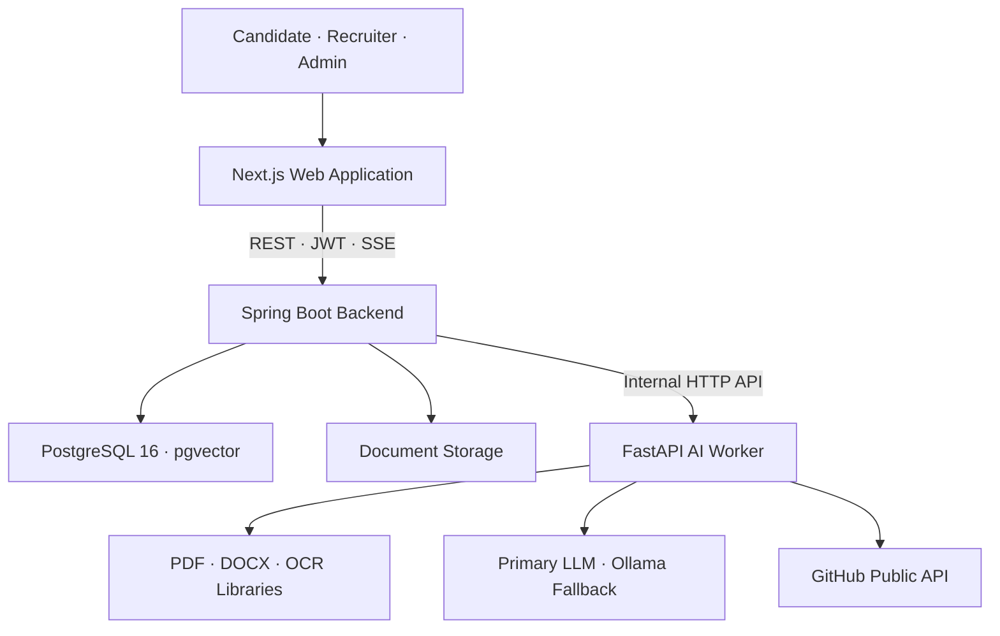
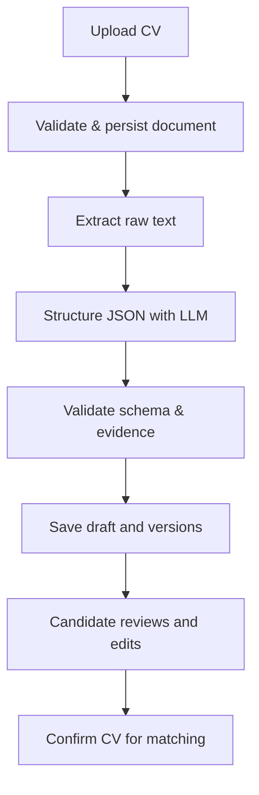
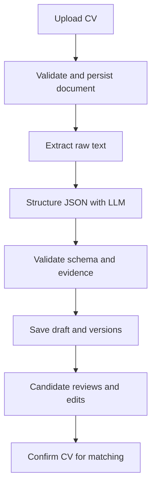

# midCV

<div align="center">

### Intelligent Recruitment Platform for Semantic JD–CV Matching and GitHub-based Competency Verification

**Nền tảng tuyển dụng thông minh hỗ trợ đối sánh ngữ nghĩa JD–CV và xác thực năng lực qua GitHub**

[](#-lộ-trình-và-tiến-độ)
[](#-công-nghệ-sử-dụng)
[](#-công-nghệ-sử-dụng)
[](#-công-nghệ-sử-dụng)
[](#-công-nghệ-sử-dụng)
[](#-công-nghệ-sử-dụng)

**[Tiếng Việt](#-tiếng-việt)** · **[English](#-english)**

</div>

---

# 🇻🇳 Tiếng Việt

## 📌 Giới thiệu

**midCV** là nền tảng tuyển dụng thông minh được xây dựng nhằm số hóa luồng tiếp nhận CV, chuẩn hóa dữ liệu ứng viên, phân tích yêu cầu công việc và hỗ trợ nhà tuyển dụng đối sánh ứng viên theo cả tiêu chí định lượng lẫn ngữ nghĩa.

Hệ thống sử dụng thư viện chuyên dụng để đọc văn bản từ **PDF, DOC/DOCX và ảnh**, sau đó sử dụng LLM để chuyển văn bản thô thành dữ liệu có cấu trúc. Dữ liệu đã được kiểm tra và xác nhận bởi người dùng được dùng cho đối sánh JD–CV, xếp hạng ứng viên, giải thích điểm số và bổ sung tín hiệu năng lực công khai từ GitHub.

> [!IMPORTANT]
> LLM không trực tiếp đọc tệp thay cho toàn bộ pipeline. Tệp được xử lý bằng thư viện/OCR trước, văn bản thô được lưu và kiểm tra, sau đó LLM chỉ đảm nhiệm bước cấu trúc hóa dữ liệu. Người dùng luôn có bước review và chỉnh sửa trước khi xác nhận hồ sơ.

### Tên đề tài

> **Nền tảng tuyển dụng thông minh hỗ trợ đối sánh ngữ nghĩa JD–CV và xác thực năng lực qua GitHub**

### Thông tin học thuật

- Đơn vị: Trường Đại học Công nghệ Thông tin – ĐHQG TP.HCM (UIT)
- Hình thức: Đồ án 1
- Trạng thái: Đang phát triển và hoàn thiện luồng nghiệp vụ chính
- Dự kiến hoàn thành phiên bản đồ án: **Tháng 12/2026**

## 👥 Thành viên

| STT | Họ và tên | Vai trò |
|---:|---|---|
| 1 | **Đoàn Việt Khang** | Thành viên phát triển dự án |
| 2 | **Phạm Ngọc Gia Khang** | Thành viên phát triển dự án |

Việc phân công chi tiết, review và bàn giao được quản lý theo issue, branch, commit và pull request của repository.

## 🎯 Mục tiêu

- Chuẩn hóa CV và JD về schema dữ liệu thống nhất, có thể kiểm tra và truy vết.
- Hỗ trợ đọc CV từ PDF có text, PDF scan, DOC/DOCX và ảnh PNG/JPG/JPEG/WEBP.
- Cho phép ứng viên review, sửa, thêm hoặc xóa dữ liệu trước khi xác nhận hồ sơ.
- Đối sánh kỹ năng theo taxonomy và ngữ nghĩa thay vì chỉ so khớp từ khóa đơn giản.
- Xếp hạng ứng viên theo tiêu chí có trọng số, đồng thời cung cấp bằng chứng giải thích.
- Khai thác dữ liệu GitHub công khai như một tín hiệu bổ sung, không thay thế đánh giá của con người.
- Bảo đảm phân quyền rõ ràng giữa Candidate, Recruiter/HR và Admin.
- Không sử dụng mock/seed làm dữ liệu sản phẩm; khi không có dữ liệu, hệ thống phải thể hiện đúng trạng thái rỗng hoặc lỗi.

## ✨ Tính năng nổi bật

Ký hiệu: ✅ đã triển khai · 🚧 đang hoàn thiện · 🗓️ trong lộ trình

| Nhóm chức năng | Nội dung | Trạng thái |
|---|---|:---:|
| Xác thực và phân quyền | Đăng ký, đăng nhập, xác thực email, JWT, RBAC và kiểm tra quyền sở hữu tài nguyên | ✅ |
| Tiếp nhận CV đa định dạng | PDF, PDF scan, DOC/DOCX và ảnh; kiểm tra loại tệp, kích thước và nội dung | ✅ |
| Trích xuất văn bản lai | Ưu tiên text layer; OCR bằng Tesseract `eng+vie` khi tài liệu là ảnh hoặc bản scan | ✅ |
| Xử lý bất đồng bộ | Trả `202 Accepted`, xử lý nền và gửi tiến độ theo từng giai đoạn qua SSE | ✅ |
| LLM có dự phòng | Provider chính theo chuẩn OpenAI-compatible; tự động chuyển sang Ollama cục bộ khi được cấu hình | ✅ |
| Structured CV | Chuẩn hóa thông tin cá nhân, học vấn, GPA, kinh nghiệm, dự án, kỹ năng, chứng chỉ, ngoại ngữ và liên kết | ✅ |
| Human-in-the-loop | Form review cho phép sửa dữ liệu, quản lý thẻ lặp, kỹ năng và nguồn gốc dữ liệu trước khi xác nhận | ✅ |
| Phiên bản và snapshot | Quản lý phiên bản CV, hồ sơ nháp và snapshot bất biến tại thời điểm nộp đơn | ✅ |
| Minh chứng hồ sơ | Tải lên, xem nhanh và quản lý minh chứng cho chứng chỉ/ngoại ngữ | ✅ |
| Quản lý tuyển dụng | Hồ sơ doanh nghiệp, tin tuyển dụng, đơn ứng tuyển, trạng thái xử lý và quyết định của HR | 🚧 |
| Đối sánh ngữ nghĩa | Embedding đa ngôn ngữ BGE-M3, lưu vector bằng pgvector và tính độ tương đồng | 🚧 |
| Explainable Matching | Phân rã điểm theo từng yếu tố, minh chứng phù hợp/thiếu và audit kết quả | 🚧 |
| GitHub enrichment | Trích xuất GitHub URL và phân tích dữ liệu công khai làm bằng chứng bổ sung | 🚧 |
| Quản trị và kiểm duyệt | Duyệt doanh nghiệp, quản lý tài khoản, đình chỉ, audit trail và tách biệt actor | 🚧 |
| Khiếu nại/khôi phục | Quy trình yêu cầu gỡ đình chỉ và khôi phục tài khoản đã tự xóa | 🗓️ |

## 🏆 Điểm nhấn kỹ thuật

- **Library-first, LLM-second:** giảm token và chi phí bằng cách chỉ gửi văn bản đã trích xuất cho LLM.
- **Human-in-the-loop:** dữ liệu AI tạo ra không tự động trở thành dữ liệu chính thức nếu người dùng chưa xác nhận.
- **Evidence-grounded JSON:** schema và bộ kiểm tra hạn chế việc LLM thêm thông tin không có trong nguồn.
- **Hybrid AI provider:** hỗ trợ provider cloud theo giao thức OpenAI-compatible và Ollama cục bộ làm phương án dự phòng.
- **Semantic search native:** PostgreSQL + pgvector lưu embedding ngay trong cơ sở dữ liệu nghiệp vụ.
- **Explainability:** định hướng giải thích từng thành phần điểm thay vì chỉ trả về một con số xếp hạng.
- **Asynchronous UX:** SSE hiển thị trạng thái và phần trăm xử lý CV theo thời gian thực.
- **Versioning and immutable snapshot:** bảo toàn CV được sử dụng tại thời điểm ứng tuyển.
- **Correlation ID và audit log:** hỗ trợ truy vết xuyên suốt Frontend → Backend → AI Worker.
- **Security by ownership:** ngoài RBAC còn kiểm tra ứng viên/nhà tuyển dụng có thực sự sở hữu tài nguyên hay không.

## 🏗️ Kiến trúc hệ thống

midCV sử dụng kiến trúc lai gồm **Frontend theo component**, **Backend modular monolith theo layer**, và **AI Worker độc lập**. Các tác vụ AI dài được xử lý bất đồng bộ để không giữ request của trình duyệt quá lâu.



### Luồng xử lý CV chính



Luồng thực thi trả về `202 Accepted` sau khi lưu bản ghi ban đầu. Backend tiếp tục xử lý nền, cập nhật các stage như `EXTRACTING_TEXT`, `RAW_TEXT_SAVED`, `STRUCTURING_CV`, `VALIDATING_STRUCTURE`, `SAVING_DRAFT` và `NEEDS_REVIEW`; frontend nhận tiến độ qua SSE.

### Phân lớp trách nhiệm

| Lớp | Trách nhiệm chính |
|---|---|
| Frontend | Giao diện, route theo actor, form review, trạng thái loading/error/empty, SSE và gọi API |
| Backend API | Xác thực, phân quyền, nghiệp vụ, transaction, versioning, audit, điều phối AI Worker |
| AI Worker | Đọc tài liệu, OCR, cấu trúc CV/JD, embedding, semantic processing và GitHub enrichment |
| Data layer | PostgreSQL, pgvector, Flyway migration, repository và ràng buộc toàn vẹn |
| External services | LLM endpoint, Ollama cục bộ và GitHub API |

## 🧰 Công nghệ sử dụng

### Frontend

| Công nghệ | Phiên bản/vai trò |
|---|---|
| Next.js | `16.3.3`, App Router và web application |
| React | `19.2.8`, xây dựng component và quản lý UI state |
| TypeScript | `5.x`, type safety cho API contract và dữ liệu CV/JD |
| Tailwind CSS | `4.x`, thiết kế responsive và thống nhất design token |
| Lucide React | Hệ thống icon |
| Playwright | `1.50+`, kiểm thử end-to-end trên Chromium |
| ESLint | `9.x`, kiểm tra chất lượng mã nguồn |

### Backend

| Công nghệ | Phiên bản/vai trò |
|---|---|
| Java | `21` |
| Spring Boot | `3.3.2` |
| Spring Web | REST API và SSE endpoint |
| Spring Data JPA / Hibernate | ORM và transaction |
| Spring Security | Authentication, JWT, RBAC và route protection |
| JJWT | `0.12.6`, access/refresh token |
| Bean Validation | Kiểm tra request và dữ liệu đầu vào |
| Flyway | Quản lý phiên bản schema cơ sở dữ liệu |
| Apache PDFBox | `3.0.5`, xử lý PDF phía Java khi cần |
| Apache POI | `5.4.1`, xử lý tài liệu Office |
| Spring Boot Actuator | Health check và quan sát runtime |
| OpenAPI / Swagger UI | Tài liệu và kiểm thử API |
| Maven | Build, dependency management và test |

### AI Worker và xử lý tài liệu

| Công nghệ | Vai trò |
|---|---|
| Python | `3.11` |
| FastAPI + Uvicorn | Internal AI service và ASGI runtime |
| Pydantic | Schema validation cho structured CV/JD |
| HTTPX | Gọi LLM endpoint và dịch vụ bên ngoài |
| pdfplumber / pypdf | Đọc text layer và bố cục PDF |
| pypdfium2 | Render trang PDF scan thành ảnh |
| python-docx | Đọc đoạn văn và bảng trong DOCX |
| Pillow | Tiền xử lý ảnh và sửa hướng EXIF |
| Tesseract 5 + pytesseract | OCR song ngữ `eng+vie` |
| LibreOffice | Tùy chọn để chuyển DOC cũ sang PDF |
| OpenAI-compatible API | LLM chính, cấu hình bằng biến môi trường |
| Ollama | LLM cục bộ dự phòng |
| BGE-M3 | Embedding đa ngôn ngữ, vector 1024 chiều |
| pytest / pytest-asyncio | Unit, contract và integration test |

### Dữ liệu, hạ tầng và chất lượng

| Công nghệ | Vai trò |
|---|---|
| PostgreSQL | `16`, cơ sở dữ liệu giao dịch chính |
| pgvector | Lưu trữ và truy vấn embedding |
| Docker Compose | Khởi tạo PostgreSQL/pgvector nhất quán |
| GitHub Actions | CI cho Backend, AI Worker, Frontend và E2E |
| GitHub API | Tín hiệu năng lực công khai của ứng viên |
| Postman | Kiểm thử API trong quá trình phát triển |

## 📁 Cấu trúc repository

```text
.
├── ai-worker/                 # FastAPI, OCR, LLM, embedding, GitHub enrichment
│   ├── app/
│   │   ├── api/
│   │   ├── schemas/
│   │   ├── services/
│   │   └── tools/
│   └── tests/
├── backend/                   # Spring Boot REST API và nghiệp vụ
│   └── src/
│       ├── main/java/
│       ├── main/resources/db/migration/
│       └── test/java/
├── frontend/                  # Next.js App Router
│   ├── src/app/
│   ├── src/components/
│   ├── src/lib/
│   ├── src/types/
│   └── e2e/
├── docs/                      # Đặc tả, thiết kế, audit và verification
├── scripts/                   # Script khởi chạy và kiểm tra môi trường
├── .github/workflows/         # CI pipelines
└── docker-compose.yml         # PostgreSQL 16 + pgvector
```

## 🚀 Khởi chạy dự án từ con số 0

Hướng dẫn dưới đây ưu tiên **Windows 10/11 + PowerShell**, là môi trường phát triển chính của nhóm.

### 1. Yêu cầu hệ thống

| Công cụ | Phiên bản khuyến nghị | Kiểm tra |
|---|---:|---|
| Git | Mới nhất | `git --version` |
| Docker Desktop | Mới nhất, Compose v2 | `docker compose version` |
| JDK | 21 | `java -version` |
| Maven | 3.9+ | `mvn -version` |
| Node.js | 20+ | `node --version` |
| npm | Đi kèm Node.js | `npm --version` |
| Python | 3.11 | `py -3.11 --version` |
| Tesseract OCR | 5.x, có `eng` và `vie` | `tesseract --list-langs` |
| Ollama | Tùy chọn nhưng khuyến nghị cho fallback | `ollama --version` |

### 2. Clone repository

```powershell
git clone https://github.com/vietkhang06/se121-midcv-ai-recruitment-platform.git
cd se121-midcv-ai-recruitment-platform
```

### 3. Tạo file cấu hình môi trường

```powershell
Copy-Item .env.example .env
Copy-Item ai-worker\.env.example ai-worker\.env
```

Nếu frontend có `frontend/.env.example`, tạo `.env.local`:

```powershell
Copy-Item frontend\.env.example frontend\.env.local
```

Nếu chưa có template frontend, tạo `frontend/.env.local` với nội dung tối thiểu:

```dotenv
NEXT_PUBLIC_API_URL=http://localhost:8080/api/v1
```

Các nhóm biến cần cấu hình:

| Phạm vi | Biến quan trọng |
|---|---|
| Database | `DATABASE_URL`, `DATABASE_USERNAME`, `DATABASE_PASSWORD` |
| Security | `JWT_SECRET`, thời hạn access/refresh token |
| Backend → AI Worker | URL nội bộ mặc định `http://127.0.0.1:8000/internal/ai` |
| Primary LLM | `AI_PROVIDER=auto`, `LLM_PRIMARY_BASE_URL`, `LLM_PRIMARY_API_KEY`, `LLM_PRIMARY_MODEL` |
| Ollama fallback | `LLM_FALLBACK_ENABLED`, `OLLAMA_BASE_URL`, `OLLAMA_CHAT_MODEL`, `OLLAMA_EMBEDDING_MODEL` |
| GitHub | `GITHUB_TOKEN` – tùy chọn nhưng giúp tăng API rate limit |
| Dev endpoints | `ENABLE_DEV_AI_TEST_ENDPOINTS=false` ngoài lúc kiểm thử có chủ đích |

> [!CAUTION]
> Không commit `.env`, API key, JWT secret, mật khẩu database hoặc token GitHub. Chỉ commit các file `.env.example` có giá trị minh họa an toàn.

### 4. Cài Tesseract OCR

Cài bản Windows của Tesseract và bảo đảm thư mục cài đặt đã nằm trong `PATH`. Sau đó kiểm tra:

```powershell
tesseract --version
tesseract --list-langs
```

Danh sách ngôn ngữ bắt buộc phải có:

```text
eng
vie
```

Nếu thiếu `vie`, tải `vie.traineddata` từ kho `tessdata` chính thức của Tesseract và đặt vào thư mục `tessdata` của bản cài đặt. Khởi động lại terminal sau khi cập nhật `PATH`.

### 5. Chuẩn bị Ollama fallback (tùy chọn)

```powershell
ollama pull dna5rm/granite4.2:3b-8k
ollama pull bge-m3
ollama list
```

Nếu không sử dụng Ollama, đặt `LLM_FALLBACK_ENABLED=false` và bảo đảm provider chính hoạt động.

### 6. Khởi tạo PostgreSQL + pgvector

Mở Docker Desktop, sau đó chạy:

```powershell
docker compose up -d postgres
docker compose ps
```

Container database phải ở trạng thái `healthy` trước khi khởi động backend.

### 7. Cài dependency AI Worker

```powershell
cd ai-worker
py -3.11 -m venv .venv
.\.venv\Scripts\Activate.ps1
python -m pip install --upgrade pip
pip install -r requirements.txt
cd ..
```

Nếu PowerShell chặn việc activate môi trường ảo:

```powershell
Set-ExecutionPolicy -Scope Process -ExecutionPolicy Bypass
.\ai-worker\.venv\Scripts\Activate.ps1
```

### 8. Cài dependency Frontend

```powershell
cd frontend
npm ci
npx playwright install chromium
cd ..
```

Maven sẽ tự tải dependency của backend trong lần build đầu tiên.

### 9. Cách chạy khuyến nghị

Từ thư mục gốc:

```powershell
powershell -NoProfile -ExecutionPolicy Bypass -File .\scripts\start-dev.ps1
```

Script khởi chạy phải kiểm tra Docker, Java, Maven, Node, Python, Tesseract, database, AI Worker, backend và frontend. Nếu script báo lỗi, xử lý dependency tương ứng thay vì tắt kiểm tra.

### 10. Chạy thủ công từng dịch vụ

Nếu cần quan sát log riêng, mở bốn terminal.

**Terminal 1 – Database**

```powershell
docker compose up -d postgres
```

**Terminal 2 – AI Worker**

```powershell
cd ai-worker
.\.venv\Scripts\Activate.ps1
python -m uvicorn app.main:app --host 127.0.0.1 --port 8000 --reload
```

**Terminal 3 – Backend**

```powershell
cd backend
mvn spring-boot:run
```

Khi chạy backend thủ công, bảo đảm các biến từ `.env` đã được nạp vào terminal hoặc cấu hình run profile của IDE.

**Terminal 4 – Frontend**

```powershell
cd frontend
npm run dev
```

### 11. Kiểm tra sau khi khởi động

| Thành phần | Địa chỉ mặc định |
|---|---|
| Frontend | <http://localhost:3000> |
| Backend API | <http://localhost:8080/api/v1> |
| Swagger UI | <http://localhost:8080/swagger-ui/index.html> |
| AI Worker health | <http://127.0.0.1:8000/internal/ai/health> |
| PostgreSQL | `localhost:5432` |

Kiểm tra nhanh bằng PowerShell:

```powershell
Invoke-RestMethod http://127.0.0.1:8000/internal/ai/health
Invoke-WebRequest http://localhost:8080/actuator/health
Invoke-WebRequest http://localhost:3000
```

## 🧪 Kiểm thử và quality gates

### AI Worker

```powershell
cd ai-worker
.\.venv\Scripts\Activate.ps1
python -m pytest -q
```

### Backend

```powershell
cd backend
mvn clean test
```

Các bài test tích hợp trực tiếp với AI Worker chỉ được xem là đã xác minh khi AI Worker đang chạy; không dùng kết quả `SKIPPED` để tuyên bố tích hợp thành công.

### Frontend

```powershell
cd frontend
npm run lint
npm run build
npx playwright test
```

E2E yêu cầu các dịch vụ phụ thuộc được khởi động đúng theo cấu hình Playwright/CI.

### Điều kiện hoàn thành một thay đổi

- Không còn conflict marker hoặc lỗi `git diff --check`.
- Backend test, AI Worker test, frontend build và E2E liên quan đều đạt.
- Không commit secret, file build, cache Python, report tạm hoặc ảnh test ngoài chủ đích.
- Không dùng mock/seed trong production path để che lỗi API hoặc dữ liệu rỗng.
- API contract, migration và tài liệu được cập nhật khi schema thay đổi.
- Mỗi phần việc có commit nguyên tử và nội dung commit mô tả đúng thay đổi thật.

## 🔐 Nguyên tắc bảo mật

- Mọi quyền truy cập được kiểm tra ở backend; route guard frontend không thay thế authorization.
- Dữ liệu Candidate, Recruiter và Admin được tách theo vai trò và ownership.
- Tài khoản quản trị không được tạo bằng mật khẩu hard-code hoặc tự động nâng quyền tài khoản có sẵn.
- Secret chỉ nằm trong environment/secret manager, không xuất hiện trong log hoặc repository.
- File upload phải được kiểm tra định dạng, dung lượng, quyền sở hữu và đường dẫn lưu trữ.
- Dữ liệu GitHub chỉ được dùng như bằng chứng hỗ trợ; hệ thống không suy diễn năng lực khi không có dữ liệu.

## 🗺️ Lộ trình và tiến độ

| Giai đoạn | Phạm vi | Trạng thái |
|---|---|:---:|
| Core platform | Authentication, RBAC, Candidate/Recruiter/Admin foundation | ✅ |
| CV intelligence | Upload, extraction, OCR, raw text, structured JSON, review và versioning | ✅ |
| Recruitment workflow | Company verification, job posting, application và recruiter decision | 🚧 |
| Matching intelligence | JD taxonomy, BGE-M3/pgvector, ranking và explainable evidence | 🚧 |
| GitHub competency | Thu thập, chuẩn hóa và trình bày tín hiệu GitHub công khai | 🚧 |
| Hardening | Account lifecycle, suspension/appeal, audit trail, observability và security review | 🗓️ |
| Release | E2E regression, tài liệu triển khai, demo và nghiệm thu | 🗓️ |

**Mốc dự kiến hoàn thành phiên bản đồ án:** Tháng 12/2026. Mốc này có thể được điều chỉnh theo kế hoạch học phần và kết quả nghiệm thu từng giai đoạn.

## 🤝 Quy trình đóng góp

1. Đồng bộ `master` mới nhất.
2. Tạo branch theo mục tiêu: `feature/...`, `fix/...`, `test/...`, `docs/...`.
3. Chỉ chỉnh sửa trong phạm vi task; chạy test liên quan trước khi commit.
4. Dùng Conventional Commits, ví dụ `feat(cv): add reviewable structured profile`.
5. Push branch và tạo pull request vào `master`.
6. Chỉ merge khi conflict đã giải quyết, CI xanh và review được chấp thuận.

## 📄 Giấy phép

Đây là dự án học thuật. Repository hiện chưa công bố giấy phép mã nguồn mở; vui lòng liên hệ nhóm phát triển trước khi sao chép hoặc sử dụng lại mã nguồn ngoài phạm vi được cho phép.

---

# 🇬🇧 English

## 📌 Overview

**midCV** is an intelligent recruitment platform designed to digitize CV ingestion, normalize candidate information, analyze job requirements, and support both deterministic and semantic candidate matching.

The platform uses dedicated libraries to extract text from **PDF, DOC/DOCX, and image files**, then asks an LLM to transform the extracted raw text into validated structured data. User-reviewed data is used for JD–CV matching, candidate ranking, explainable scoring, and optional enrichment with public GitHub signals.

> [!IMPORTANT]
> The LLM does not replace the document extraction pipeline. Libraries and OCR process the file first, raw text is persisted and inspected, and the LLM is used only for structuring. A human review step is required before the profile becomes authoritative.

### Project title

> **An Intelligent Recruitment Platform for Semantic JD–CV Matching and GitHub-based Competency Verification**

### Academic information

- Institution: University of Information Technology – VNU-HCM (UIT)
- Project type: Undergraduate Project 1
- Status: Active development and core-flow stabilization
- Target project release: **December 2026**

## 👥 Team

| No. | Name | Role |
|---:|---|---|
| 1 | **Đoàn Việt Khang** | Project development team member |
| 2 | **Phạm Ngọc Gia Khang** | Project development team member |

Detailed ownership, reviews, and handoffs are tracked through repository issues, branches, commits, and pull requests.

## 🎯 Objectives

- Normalize CVs and JDs into a consistent, traceable data schema.
- Read native PDFs, scanned PDFs, DOC/DOCX documents, and PNG/JPG/JPEG/WEBP images.
- Allow candidates to review, edit, add, or remove extracted data before confirmation.
- Match taxonomy skills and semantic meaning instead of relying on basic keyword overlap.
- Rank candidates with configurable factors and evidence-backed explanations.
- Use public GitHub data as an additional signal rather than a replacement for human assessment.
- Enforce clear authorization boundaries between Candidate, Recruiter/HR, and Admin actors.
- Never use mock or seed data as a production fallback; missing data must remain explicitly empty or unavailable.

## ✨ Key features

Legend: ✅ implemented · 🚧 being completed · 🗓️ planned

| Area | Capability | Status |
|---|---|:---:|
| Authentication and authorization | Registration, login, email verification, JWT, RBAC, and resource ownership checks | ✅ |
| Multi-format CV ingestion | PDF, scanned PDF, DOC/DOCX, and images with format and size validation | ✅ |
| Hybrid text extraction | Native text first; Tesseract `eng+vie` OCR for images and scanned documents | ✅ |
| Asynchronous processing | `202 Accepted`, background processing, and stage-by-stage SSE progress | ✅ |
| LLM fallback chain | OpenAI-compatible primary provider with optional local Ollama fallback | ✅ |
| Structured CV | Personal data, education, GPA, experience, projects, skills, certificates, languages, and links | ✅ |
| Human-in-the-loop review | Editable repeatable cards, skills, provenance, and explicit profile confirmation | ✅ |
| Versioning and snapshots | Draft versions and an immutable CV snapshot at application time | ✅ |
| Profile evidence | Upload, preview, and management of certificate/language evidence | ✅ |
| Recruitment workflow | Company profile, jobs, applications, statuses, and HR decisions | 🚧 |
| Semantic matching | Multilingual BGE-M3 embeddings, pgvector persistence, and similarity calculation | 🚧 |
| Explainable matching | Factor breakdown, supporting/missing evidence, and result auditing | 🚧 |
| GitHub enrichment | GitHub URL extraction and public competency signals | 🚧 |
| Administration | Company verification, account moderation, suspension, actor isolation, and audit trail | 🚧 |
| Appeals and recovery | Suspension appeal and self-deleted account recovery workflows | 🗓️ |

## 🏆 Technical differentiators

- **Library-first, LLM-second:** reduces token usage and cost by sending extracted text rather than whole files to the LLM.
- **Human-in-the-loop:** AI output never becomes authoritative before explicit user confirmation.
- **Evidence-grounded JSON:** schemas and validation reduce unsupported LLM-generated claims.
- **Hybrid AI providers:** supports a cloud OpenAI-compatible endpoint with an optional local Ollama fallback.
- **Native semantic storage:** PostgreSQL and pgvector keep embeddings close to transactional data.
- **Explainability:** scoring is designed to expose factor-level evidence instead of returning only a ranking number.
- **Asynchronous user experience:** SSE reports CV-processing stages and percentage progress in real time.
- **Versioning and immutable snapshots:** preserves the exact CV used for each application.
- **Correlation IDs and audit logs:** trace requests across Frontend, Backend, and AI Worker.
- **Ownership-aware security:** combines role checks with tenant/resource ownership validation.

## 🏗️ Architecture

midCV uses a hybrid architecture composed of a **component-based frontend**, a **layered modular-monolith backend**, and an **independent AI Worker**. Long-running AI tasks are processed asynchronously instead of holding browser requests open.


### Main CV processing flow



The upload flow returns `202 Accepted` after initial persistence. The backend continues processing and emits stages such as `EXTRACTING_TEXT`, `RAW_TEXT_SAVED`, `STRUCTURING_CV`, `VALIDATING_STRUCTURE`, `SAVING_DRAFT`, and `NEEDS_REVIEW`; the frontend receives progress through SSE.

### Responsibility boundaries

| Layer | Primary responsibility |
|---|---|
| Frontend | Actor-specific routes, review forms, loading/error/empty states, SSE, and API integration |
| Backend API | Authentication, authorization, business rules, transactions, versioning, auditing, and AI orchestration |
| AI Worker | Document extraction, OCR, CV/JD structuring, embeddings, semantic processing, and GitHub enrichment |
| Data layer | PostgreSQL, pgvector, Flyway migrations, repositories, and integrity constraints |
| External services | LLM endpoint, local Ollama, and GitHub API |

## 🧰 Technology stack

### Frontend

| Technology | Version/purpose |
|---|---|
| Next.js | `16.3.3`, App Router and web application |
| React | `19.2.8`, component model and UI state |
| TypeScript | `5.x`, type-safe API contracts and CV/JD data |
| Tailwind CSS | `4.x`, responsive UI and design tokens |
| Lucide React | Icon system |
| Playwright | `1.50+`, Chromium end-to-end testing |
| ESLint | `9.x`, static code quality checks |

### Backend

| Technology | Version/purpose |
|---|---|
| Java | `21` |
| Spring Boot | `3.3.2` |
| Spring Web | REST APIs and SSE endpoints |
| Spring Data JPA / Hibernate | ORM and transaction management |
| Spring Security | Authentication, JWT, RBAC, and route protection |
| JJWT | `0.12.6`, access and refresh tokens |
| Bean Validation | Request and domain validation |
| Flyway | Database schema versioning |
| Apache PDFBox | `3.0.5`, Java-side PDF processing where required |
| Apache POI | `5.4.1`, Office document processing |
| Spring Boot Actuator | Runtime health and observability |
| OpenAPI / Swagger UI | API documentation and exploration |
| Maven | Build, dependencies, and tests |

### AI Worker and document processing

| Technology | Purpose |
|---|---|
| Python | `3.11` |
| FastAPI + Uvicorn | Internal AI service and ASGI runtime |
| Pydantic | Structured CV/JD schema validation |
| HTTPX | LLM and external HTTP integrations |
| pdfplumber / pypdf | PDF text-layer and layout extraction |
| pypdfium2 | Rendering scanned PDF pages |
| python-docx | Ordered DOCX paragraph and table extraction |
| Pillow | Image preprocessing and EXIF orientation correction |
| Tesseract 5 + pytesseract | Bilingual `eng+vie` OCR |
| LibreOffice | Optional legacy DOC-to-PDF conversion |
| OpenAI-compatible API | Environment-configured primary LLM |
| Ollama | Optional local LLM fallback |
| BGE-M3 | Multilingual 1024-dimensional embeddings |
| pytest / pytest-asyncio | Unit, contract, and integration tests |

### Data, infrastructure, and quality

| Technology | Purpose |
|---|---|
| PostgreSQL | `16`, primary transactional database |
| pgvector | Embedding persistence and similarity queries |
| Docker Compose | Reproducible PostgreSQL/pgvector environment |
| GitHub Actions | Backend, AI Worker, Frontend, and E2E CI |
| GitHub API | Public candidate competency signals |
| Postman | API verification during development |

## 📁 Repository structure

```text
.
├── ai-worker/                 # FastAPI, OCR, LLM, embeddings, GitHub enrichment
│   ├── app/
│   │   ├── api/
│   │   ├── schemas/
│   │   ├── services/
│   │   └── tools/
│   └── tests/
├── backend/                   # Spring Boot REST APIs and business rules
│   └── src/
│       ├── main/java/
│       ├── main/resources/db/migration/
│       └── test/java/
├── frontend/                  # Next.js App Router
│   ├── src/app/
│   ├── src/components/
│   ├── src/lib/
│   ├── src/types/
│   └── e2e/
├── docs/                      # Requirements, design, audits, and verification
├── scripts/                   # Environment checks and local startup
├── .github/workflows/         # CI pipelines
└── docker-compose.yml         # PostgreSQL 16 + pgvector
```

## 🚀 Start from a clean machine

The commands below prioritize **Windows 10/11 with PowerShell**, the team's primary development environment.

### 1. Prerequisites

| Tool | Recommended version | Verification |
|---|---:|---|
| Git | Latest | `git --version` |
| Docker Desktop | Latest, Compose v2 | `docker compose version` |
| JDK | 21 | `java -version` |
| Maven | 3.9+ | `mvn -version` |
| Node.js | 20+ | `node --version` |
| npm | Bundled with Node.js | `npm --version` |
| Python | 3.11 | `py -3.11 --version` |
| Tesseract OCR | 5.x with `eng` and `vie` | `tesseract --list-langs` |
| Ollama | Optional, recommended for fallback | `ollama --version` |

### 2. Clone the repository

```powershell
git clone https://github.com/vietkhang06/se121-midcv-ai-recruitment-platform.git
cd se121-midcv-ai-recruitment-platform
```

### 3. Create environment files

```powershell
Copy-Item .env.example .env
Copy-Item ai-worker\.env.example ai-worker\.env
```

If `frontend/.env.example` exists:

```powershell
Copy-Item frontend\.env.example frontend\.env.local
```

Otherwise, create `frontend/.env.local` with:

```dotenv
NEXT_PUBLIC_API_URL=http://localhost:8080/api/v1
```

Required configuration groups:

| Scope | Important variables |
|---|---|
| Database | `DATABASE_URL`, `DATABASE_USERNAME`, `DATABASE_PASSWORD` |
| Security | `JWT_SECRET`, access/refresh token expiration |
| Backend → AI Worker | Internal URL defaults to `http://127.0.0.1:8000/internal/ai` |
| Primary LLM | `AI_PROVIDER=auto`, `LLM_PRIMARY_BASE_URL`, `LLM_PRIMARY_API_KEY`, `LLM_PRIMARY_MODEL` |
| Ollama fallback | `LLM_FALLBACK_ENABLED`, `OLLAMA_BASE_URL`, `OLLAMA_CHAT_MODEL`, `OLLAMA_EMBEDDING_MODEL` |
| GitHub | `GITHUB_TOKEN` – optional, but increases API rate limits |
| Development endpoints | Keep `ENABLE_DEV_AI_TEST_ENDPOINTS=false` unless intentionally testing them |

> [!CAUTION]
> Never commit `.env`, API keys, JWT secrets, database passwords, or GitHub tokens. Commit only sanitized `.env.example` templates.

### 4. Install Tesseract OCR

Install Tesseract for Windows and add its installation directory to `PATH`, then verify:

```powershell
tesseract --version
tesseract --list-langs
```

Both language packs must be listed:

```text
eng
vie
```

If `vie` is missing, download `vie.traineddata` from the official Tesseract `tessdata` repository and place it in the installation's `tessdata` directory. Restart the terminal after changing `PATH`.

### 5. Prepare the optional Ollama fallback

```powershell
ollama pull dna5rm/granite4.2:3b-8k
ollama pull bge-m3
ollama list
```

If Ollama is not used, set `LLM_FALLBACK_ENABLED=false` and ensure the primary provider is available.

### 6. Start PostgreSQL and pgvector

Start Docker Desktop, then run:

```powershell
docker compose up -d postgres
docker compose ps
```

The database container must be `healthy` before starting the backend.

### 7. Install AI Worker dependencies

```powershell
cd ai-worker
py -3.11 -m venv .venv
.\.venv\Scripts\Activate.ps1
python -m pip install --upgrade pip
pip install -r requirements.txt
cd ..
```

If PowerShell blocks virtual-environment activation:

```powershell
Set-ExecutionPolicy -Scope Process -ExecutionPolicy Bypass
.\ai-worker\.venv\Scripts\Activate.ps1
```

### 8. Install Frontend dependencies

```powershell
cd frontend
npm ci
npx playwright install chromium
cd ..
```

Maven downloads backend dependencies during the first build.

### 9. Recommended startup

From the repository root:

```powershell
powershell -NoProfile -ExecutionPolicy Bypass -File .\scripts\start-dev.ps1
```

The startup script should validate Docker, Java, Maven, Node, Python, Tesseract, the database, AI Worker, Backend, and Frontend. Resolve missing dependencies rather than disabling validation.

### 10. Start services manually

For isolated logs, use four terminals.

**Terminal 1 – Database**

```powershell
docker compose up -d postgres
```

**Terminal 2 – AI Worker**

```powershell
cd ai-worker
.\.venv\Scripts\Activate.ps1
python -m uvicorn app.main:app --host 127.0.0.1 --port 8000 --reload
```

**Terminal 3 – Backend**

```powershell
cd backend
mvn spring-boot:run
```

When starting the backend manually, ensure that root `.env` variables have been loaded into the terminal or the IDE run profile.

**Terminal 4 – Frontend**

```powershell
cd frontend
npm run dev
```

### 11. Verify the running system

| Component | Default address |
|---|---|
| Frontend | <http://localhost:3000> |
| Backend API | <http://localhost:8080/api/v1> |
| Swagger UI | <http://localhost:8080/swagger-ui/index.html> |
| AI Worker health | <http://127.0.0.1:8000/internal/ai/health> |
| PostgreSQL | `localhost:5432` |

Quick PowerShell checks:

```powershell
Invoke-RestMethod http://127.0.0.1:8000/internal/ai/health
Invoke-WebRequest http://localhost:8080/actuator/health
Invoke-WebRequest http://localhost:3000
```

## 🧪 Testing and quality gates

### AI Worker

```powershell
cd ai-worker
.\.venv\Scripts\Activate.ps1
python -m pytest -q
```

### Backend

```powershell
cd backend
mvn clean test
```

Live AI Worker integration tests are verified only when the AI Worker is actually running; a `SKIPPED` test must not be reported as successful integration.

### Frontend

```powershell
cd frontend
npm run lint
npm run build
npx playwright test
```

E2E tests require all dependencies configured by Playwright/CI to be running.

### Definition of done

- No unresolved conflict markers and no `git diff --check` errors.
- Relevant Backend, AI Worker, Frontend build, and E2E checks pass.
- No secrets, generated build files, Python caches, temporary reports, or accidental test screenshots are committed.
- No mock/seed production fallback hides API failures or empty data.
- API contracts, migrations, and documentation are updated whenever schemas change.
- Each unit of work has an atomic commit whose message describes the actual change.

## 🔐 Security principles

- All access decisions are enforced by the backend; frontend route guards are not authorization controls.
- Candidate, Recruiter, and Admin data is isolated through role and ownership checks.
- Admin bootstrap must not use hard-coded passwords or promote an existing account.
- Secrets belong in environment variables or a secret manager, never logs or the repository.
- File uploads require type, size, ownership, and storage-path validation.
- GitHub data is supporting evidence only; the platform must not infer competency when evidence is unavailable.

## 🗺️ Roadmap and schedule

| Phase | Scope | Status |
|---|---|:---:|
| Core platform | Authentication, RBAC, and Candidate/Recruiter/Admin foundations | ✅ |
| CV intelligence | Upload, extraction, OCR, raw text, structured JSON, review, and versioning | ✅ |
| Recruitment workflow | Company verification, jobs, applications, and recruiter decisions | 🚧 |
| Matching intelligence | JD taxonomy, BGE-M3/pgvector, ranking, and explainable evidence | 🚧 |
| GitHub competency | Public GitHub signal collection, normalization, and presentation | 🚧 |
| Hardening | Account lifecycle, suspension/appeal, audit trail, observability, and security review | 🗓️ |
| Release | E2E regression, deployment documentation, demo, and acceptance | 🗓️ |

**Target project release:** December 2026. The date may be adjusted according to the academic schedule and phase acceptance results.

## 🤝 Contribution workflow

1. Synchronize the latest `master` branch.
2. Create a scoped branch: `feature/...`, `fix/...`, `test/...`, or `docs/...`.
3. Keep changes within the assigned task and run relevant checks before committing.
4. Use Conventional Commits, for example `feat(cv): add reviewable structured profile`.
5. Push the branch and open a pull request into `master`.
6. Merge only after conflicts are resolved, CI is green, and review is approved.

## 📄 License

This is an academic project. No open-source license has been published yet; please contact the development team before copying or reusing the source code outside the permitted scope.

---

<div align="center">

Developed by **Đoàn Việt Khang** and **Phạm Ngọc Gia Khang**<br />
University of Information Technology – VNU-HCM

</div>
