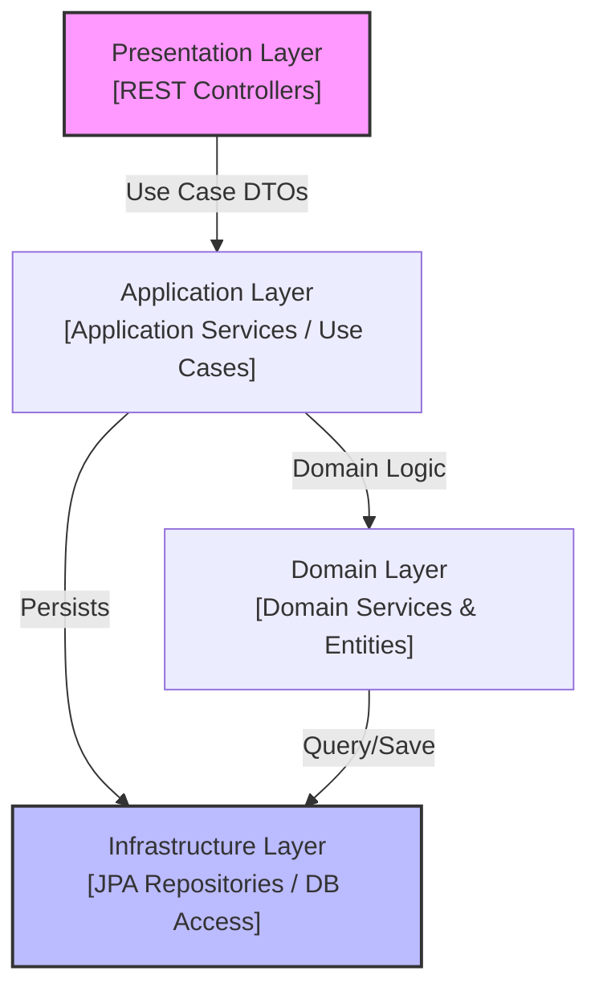
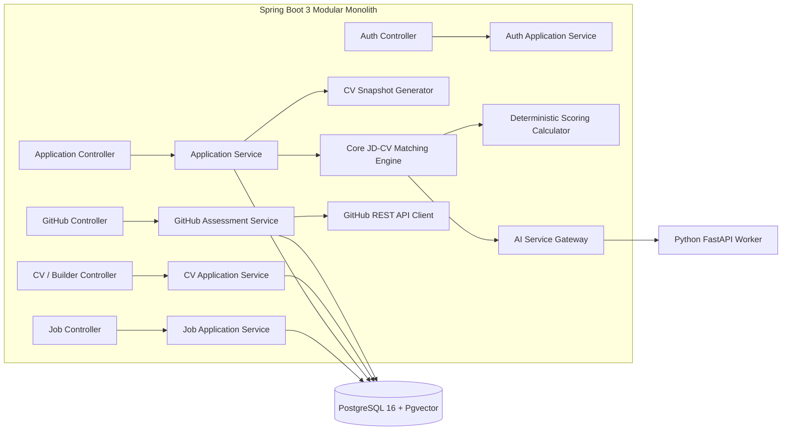

# BACKEND ARCHITECTURE SPECIFICATION (REVISED)

Tài liệu này đặc tả Kiến trúc Backend (Java Spring Boot 3 Modular Monolith), cấu trúc Package/Module cập nhật, Quy tắc phân lớp (Layered Architecture Rules), Quản lý Giao dịch và Xử lý Ngoại lệ.

---

## 1. CẤU TRÚC MO-ĐUN & PACKAGE (UPDATED PACKAGE STRUCTURE)

Mã nguồn Backend Java Spring Boot 3 được tổ chức theo mô hình **Modular Monolith** chuẩn hóa dưới package gốc `com.platform.recruitment`:

```text
com.platform.recruitment
│
├── auth                # Register Candidate/HR, Login, Password Encoding, JWT Token Provider
├── user                # User entity, UserDetailsService, User Role Enums (CANDIDATE, HR, ADMIN)
├── candidate           # Candidate profile, Target Industry, Common Profile Data
├── recruiter           # Recruiter profile, Company linking, Authorization guards
├── company             # Company profile, Company Verification Status (PENDING, VERIFIED, REJECTED)
├── job                 # Job creation, Multi-Industry JD Requirements, Seniority, Salary
├── application         # Application submission, Quick Apply, Immutable ApplicationCVSnapshot
├── cv                  # CV Metadata management, Path A Upload PDF/DOCX Parsing, CV Library
├── cvbuilder           # Path B Platform CV Builder, Industry Template Recommendation, PDF Exporter
├── github              # Secondary GitHub Sync Worker, Language Ranking, Activity Signal, Repos
├── matching            # Core JD-CV Deterministic Hybrid Scoring Engine, Ranking, Evidence Rules
├── ai                  # AI Client Gateway, Python Service Integration, Prompt Engineering
├── embedding           # Vector Embedding conversion, Pgvector Cosine similarity operations
├── file                # Storage Service (PDF/DOCX Private Storage & Stream Controller)
└── common              # Shared DTOs, Base Entities, Exceptions, Utilities, Constants
```

---

## 2. QUY TẮC PHÂN LỚP VÀ RANH GIỚI TRÁCH NHIỆM (LAYERED ARCHITECTURE RULES)



### THỦ TỤC VÀ QUY TẮC NGHIÊM NGẶT (STRICT ARCHITECTURAL CONSTRAINTS):
1. **NO Controller-to-Repository Access:** Controller **TUYỆT ĐỐI KHÔNG** được phép autowire hoặc gọi trực tiếp JPA Repository (`JobRepository`, `UserRepository`, `CVRepository`). Mọi thao tác phải đi qua Application Service.
2. **NO Business Logic in Controllers:** Controller chỉ đảm nhận: Receive request $\rightarrow$ Validate DTO (`@Valid`) $\rightarrow$ Delegate to Application Service $\rightarrow$ Return `ResponseEntity<ApiResponse<T>>`.
3. **Immutable Application CV Snapshot Rule:** Service khi thực hiện nộp đơn (`ApplicationService.submitApplication`) **BẮT BUỘC** phải tạo bản snapshot độc lập `ApplicationCVSnapshot` lưu thông tin CV tại thời điểm apply.
4. **GitHub Secondary Fallback Rule:** Service `GitHubSyncService` khi gặp lỗi API rate limit hoặc URL invalid phải bắt ngoại lệ `GitHubSyncException` một cách êm ái, ghi log warning và cập nhật `GitHubProfile.status = UNAVAILABLE` mà **KHÔNG** làm crash luồng Core Matching.

---

## 3. BACKEND COMPONENT DIAGRAM (C4 LEVEL 3)



---

## 4. XỬ LÝ TRANSACTION VÀ EXCEPTION (TRANSACTIONS & EXCEPTION HANDLING)

### 4.1 Quản lý Transaction (`@Transactional`)
* Mọi phương thức ghi dữ liệu trong Service đánh dấu `@Transactional(rollbackFor = Exception.class)`.
* Các phương thức truy vấn đọc dữ liệu đánh dấu `@Transactional(readOnly = true)`.

### 4.2 Mã Lỗi Hệ thống Chuẩn hóa (System Error Code Registry)
* `AUTH_INVALID_CREDENTIALS` (401): Sai email hoặc mật khẩu.
* `COMPANY_NOT_VERIFIED` (403): Đơn vị tuyển dụng chưa đạt trạng thái `VERIFIED`.
* `CV_NOT_FOUND` (404): Không tìm thấy bản CV yêu cầu.
* `APPLICATION_ALREADY_EXISTS` (409): Candidate đã nộp đơn cho công việc này.
* `GITHUB_LIMIT_EXCEEDED` (429): Quá hạn ngạch gọi GitHub Public API (Fallback triggered).
