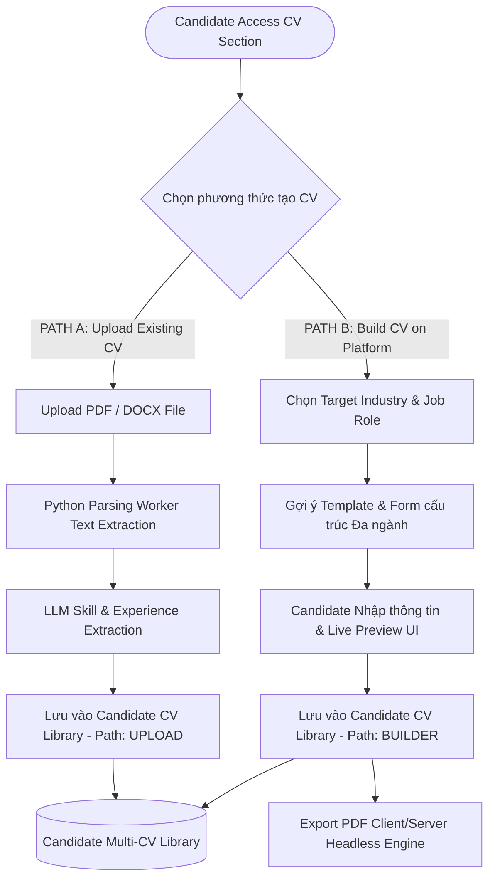
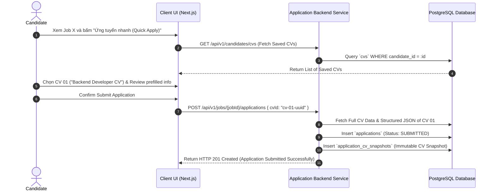
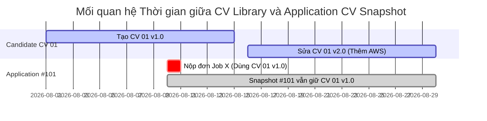

# CV BUILDER & VERSIONING ARCHITECTURE SPECIFICATION

Tài liệu này đặc tả Kiến trúc CV Builder đa ngành, Quy trình Song đường CV (Two-Path CV), Thư viện Multi-CV Library, Quy trình Nộp đơn nhanh (Quick Apply) và Cơ chế Snapshot CV đơn ứng tuyển không thể thay đổi (`ApplicationCVSnapshot`).

---

## 1. KIẾN TRÚC SONG ĐƯỜNG CV (TWO-PATH CV ARCHITECTURE)

---

## 2. QUY TRÌNH NỘP ĐƠN NHANH (QUICK APPLY WORKFLOW)

Candidate không cần phải tải lại file CV cho mỗi lần ứng tuyển:

---

## 3. CƠ CHẾ NGUYÊN PHONG CỦA CV SNAPSHOT (`ApplicationCVSnapshot`)

### NGUYÊN TẮC BẮT BUỘC (IMMUTABLE SNAPSHOT RULE):
1. Khi Candidate nộp đơn ứng tuyển cho một Job tại thời điểm $T_0$, Backend tự động sao chép toàn bộ dữ liệu văn bản thô và JSON cấu trúc của CV được chọn vào bảng `application_cv_snapshots`.
2. Nếu sau đó tại thời điểm $T_1$, Candidate cập nhật, bổ sung kỹ năng hoặc sửa đổi nội dung CV trong thư viện cá nhân, **bản sao snapshot trong `application_cv_snapshots` KHÔNG BỊ THAY ĐỔI**.
3. Báo cáo AI Matching và màn hình HR xem lại hồ sơ ứng tuyển của đơn ứng tuyển đó sẽ **luôn luôn dựa trên bản snapshot tại thời điểm nộp đơn**.
