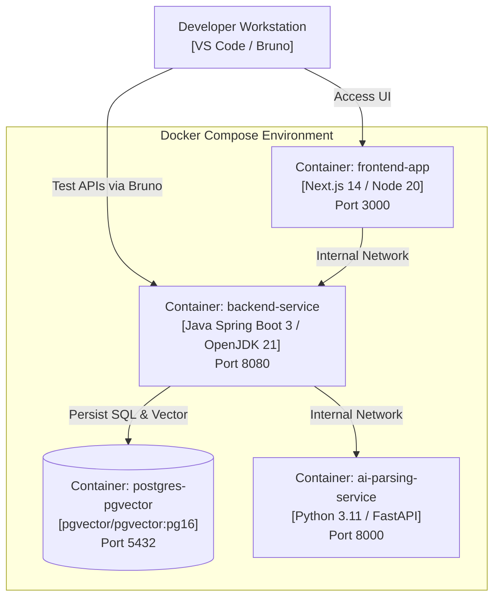
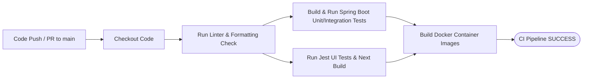

# DEPLOYMENT ARCHITECTURE & CI SPECIFICATION

Tài liệu này đặc tả Kiến trúc Triển khai Môi trường Phát triển (Local Development Environment), cấu hình Docker Compose, Chiến lược Biến môi trường và Tự động hóa CI (GitHub Actions).

---

## 1. MÔ HÌNH TRIỂN KHAI PHÁT TRIỂN NỘI BỘ (LOCAL DOCKER COMPOSE TOPOLOGY)

---

## 2. CHIẾN LƯỢC CẤU HÌNH MÔI TRƯỜNG (ENVIRONMENT STRATEGY)

Hệ thống quản lý cấu hình thông qua các biến môi trường (Environment Variables):

| Tên Biến Môi trường | Mô tả | Mẫu Môi trường Dev Local |
| :--- | :--- | :--- |
| `DATABASE_URL` | Chuỗi kết nối JDBC PostgreSQL | `jdbc:postgresql://localhost:5432/airecruit_db` |
| `DATABASE_USERNAME` | Tên đăng nhập Database | `postgres` |
| `DATABASE_PASSWORD` | Mật khẩu Database | `postgres_secure_pass` |
| `JWT_SECRET` | Secret key ký JWT Token (>= 256 bits) | `d9f8e7d6c5b4a3f2e1d0c9b8a7f6e5d4c3b2a1` |
| `OPENAI_API_KEY` | Key gọi LLM & Embedding API | `sk-proj-xxxxxxxxxxxxxxxxxxxxxxxx` |
| `EMBEDDING_MODEL` | Tên mô hình Vector Embedding | `text-embedding-3-small` |
| `FILE_STORAGE_PATH` | Thư mục lưu trữ file CV nội bộ | `./uploads/cvs/private` |

---

## 3. TỰ ĐỘNG HÓA CI PIPELINE (GITHUB ACTIONS CI SPECIFICATION)

Cấu hình quy trình Tự động hóa Kiểm thử và Build mã nguồn tại `.github/workflows/ci.yml`:

