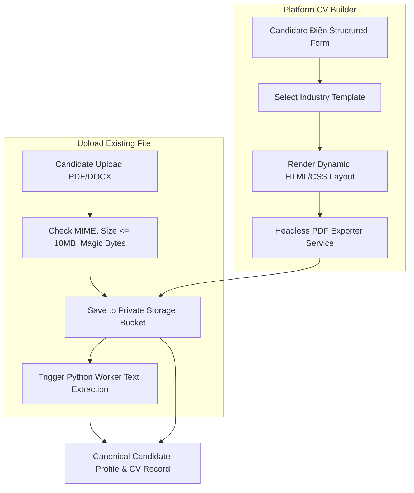
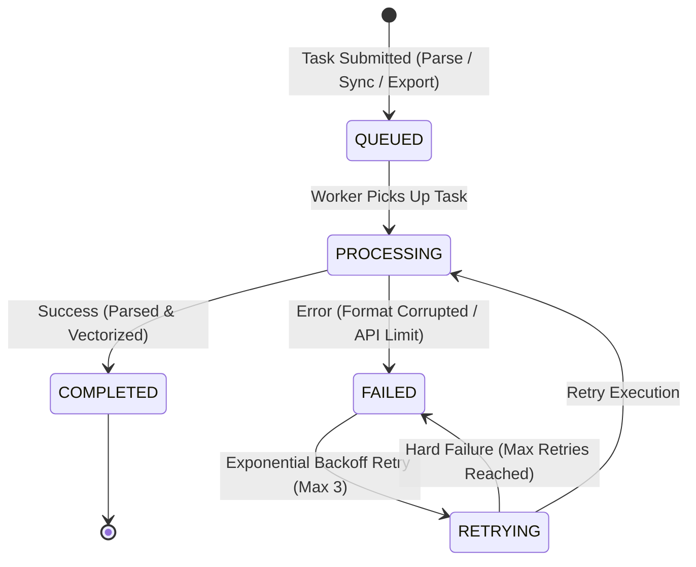

# FILE PROCESSING ARCHITECTURE SPECIFICATION (REVISED)

Tài liệu này đặc tả Kiến trúc Xử lý Tập tin cho cả 2 con đường CV (Path A Upload & Path B CV Builder Export PDF), Bảo mật Lưu trữ Riêng tư và Vòng đời Trạng thái Xử lý Tác vụ Bất đồng bộ.

---

## 1. SONG ĐƯỜNG XỬ LÝ VÀ TẠO FILE CV (TWO-PATH FILE ARCHITECTURE)

---

## 2. VÒNG ĐỜI TRẠNG THÁI TÁC VỤ BẤT ĐỒNG BỘ (ASYNC TASK LIFECYCLE)

---

## 3. BẢO MẬT STREAMING FILE CV VÀ ACCESSIBILITY

* **No Public URLs:** Tập tin CV tải lên hoặc export không cấp URL tĩnh công khai.
* **Authorized Streaming Controller:** Truy cập qua API `GET /api/v1/candidates/cv/{cvId}/download`. Backend xác thực Token và kiểm tra xem User có phải là chính chủ Candidate sở hữu CV hoặc HR của Job đã ứng tuyển. Thỏa mãn thì stream dưới dạng HTTP Response `application/pdf`.
