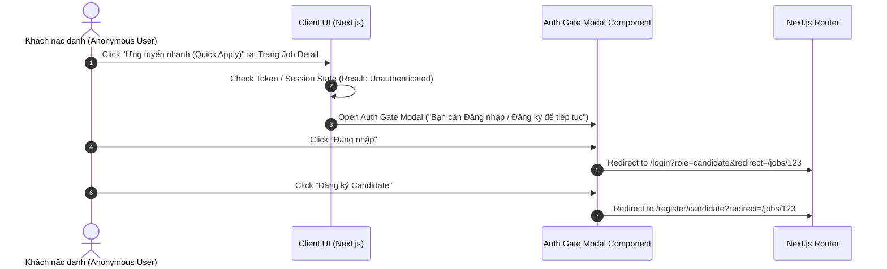

# FRONTEND ARCHITECTURE SPECIFICATION (REVISED)

Tài liệu này đặc tả Kiến trúc Frontend (Next.js App Router, TypeScript, React 19), cấu trúc Định tuyến công khai/bảo vệ, Modal Onboarding lần đầu, Authentication Gate Modal, CV Builder UI và Tab Đánh giá GitHub hỗ trợ.

---

## 1. CẤU TRÚC ĐỊNH TUYẾN NEXT.JS APP ROUTER (UPDATED ROUTE STRUCTURE)

```text
src/
├── app/
│   ├── (public)/                     # Group Route Công khai (Guest / Anonymous Allowed)
│   │   ├── page.tsx                  # Landing Page + First-Visit Onboarding Modal
│   │   ├── jobs/
│   │   │   ├── page.tsx              # Job Search & Multi-Industry Filter
│   │   │   └── [id]/page.tsx         # Public Job Detail (Chứa Quick Apply Button -> Auth Gate if unauth)
│   │   ├── login/page.tsx            # Login Screen (Option: Candidate vs HR)
│   │   └── register/
│   │       ├── candidate/page.tsx    # Candidate Registration (Prefilled from Onboarding)
│   │       └── recruiter/page.tsx    # HR Registration (Recruiter Info + Company Info)
│   │
│   ├── (candidate)/                  # Protected Group Route dành riêng cho Candidate
│   │   ├── layout.tsx                # Candidate Navigation Header
│   │   └── candidate/
│   │       ├── profile/page.tsx      # Candidate Common Profile & Target Industry
│   │       ├── cv/
│   │       │   ├── page.tsx          # Multi-CV Library (List, Edit, Duplicate, Delete, Quick Select)
│   │       │   ├── upload/page.tsx   # Path A: Upload File PDF/DOCX Parsing
│   │       │   └── builder/page.tsx  # Path B: Platform CV Builder (Industry Template, Form, Preview, Export)
│   │       └── applications/page.tsx # Application History & Snapshot View
│   │
│   └── (recruiter)/                  # Protected Group Route dành riêng cho HR / Recruiter
│       ├── layout.tsx                # Recruiter Sidebar Navigation & Verification Status Banner
│       └── recruiter/
│           ├── dashboard/page.tsx    # Employer Dashboard & Company Verification Status
│           ├── company/page.tsx      # Company Profile & Identity Documents
│           ├── jobs/
│           │   ├── page.tsx          # Job Management
│           │   ├── new/page.tsx      # Create Job (Multi-Industry Requirements)
│           │   └── [id]/
│           │       ├── ranking/page.tsx # Candidate Ranking List (Sort by Match Score)
│           │       └── apps/page.tsx # Applications List
│           └── applications/
│               └── [id]/
│                   └── report/page.tsx # Detail Inspector: Tab 1 (Core Matching) & Tab 2 (GitHub Assessment)
```

---

## 2. QUY TRÌNH KÍCH HOẠT AUTHENTICATION GATE (AUTH GATE MODAL FLOW)



---

## 3. THIẾT KẾ CÁC GIAO DIỆN CỐT LÕI (CORE UI COMPONENTS SPECIFICATION)

### 3.1 Onboarding Modal Lần đầu (First-Visit Onboarding Modal)
* **Vị trí:** Tự động kích hoạt khi người dùng lần đầu truy cập trang chủ (Lưu trạng thái `onboarding_completed` ở LocalStorage/Cookie).
* **Nội dung:** 3 Nút lựa chọn rực rỡ:
  1. `[ Tôi đang tìm việc ]` $\rightarrow$ Mở Popup hỏi nhanh (Tuổi & Ngành nghề mong muốn) $\rightarrow$ Redirect Đăng ký Candidate (Prefilled).
  2. `[ Tôi đang tìm ứng viên ]` $\rightarrow$ Redirect Đăng ký HR (Recruiter + Company Info).
  3. `[ Skip ]` $\rightarrow$ Đóng Modal, chuyển tới giao diện tìm kiếm việc làm công khai.

### 3.2 Giao diện Báo cáo HR Inspector (Two-Tab Detail Inspection View)
* **Tab 1: CORE JD-CV MATCHING REPORT**
  * Badge Match Score rực rỡ (`91.7%` HIGH MATCH).
  * Section Matching Skills ($\checkmark$ Java, Spring Boot, PostgreSQL) vs Missing Skills ($\times$ AWS).
  * Section Evidence Snippets (Trích dẫn nguyên văn văn bản từ CV trang $N$).
* **Tab 2: SECONDARY GITHUB SUPPORTING ASSESSMENT**
  * Top Languages Ranked Chart (1. Java 45%, 2. TypeScript 30%, 3. Python 25%).
  * Repository Relevance List (Các Repo có tech stack trùng hợp với JD).
  * Activity Recency Badge (VD: *"Hoạt động công khai gần nhất: 18 ngày trước"*).
  * Observability Banner (*"Dữ liệu công khai trên GitHub chỉ mang tính chất tín hiệu hỗ trợ, không đại diện tuyệt đối cho toàn bộ quá trình làm việc của ứng viên"*).
