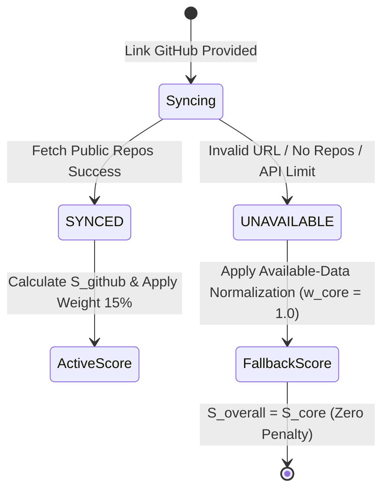

# GITHUB SUPPORTING ASSESSMENT ARCHITECTURE SPECIFICATION (REVISED)

Tài liệu này đặc tả Kiến trúc Đánh giá GitHub Hỗ trợ (Secondary Supporting Signal Engine), công thức tính điểm GitHub Supporting Score ($S_{\text{github}}$), thuật toán xếp hạng ngôn ngữ lập trình, Tín hiệu Hoạt động Công khai quan sát được (Activity Signal), phân định giữa Hoạt động (Activity) vs Đóng góp (Contribution), và Chiến lược Fallback khi không có dữ liệu.

---

## 1. THUẬT TOÁN XẾP HẠNG NGÔN NGỮ VÀ PHÂN BỔ MÃ NGUỒN (LANGUAGE RANKING & DISTRIBUTION)

### 1.1 Quy tắc Diễn đạt Từ ngữ (Terminology Standard)
* **KHÔNG DÙNG:** "Percentage of developer skill" (Tỷ lệ phần trăm kỹ năng lập trình viên).
* **BẮT BUỘC DÙNG:** **"Repository language distribution"** (Tỷ lệ phân bổ ngôn ngữ lập trình trong các repository công khai).

### 1.2 Thuật toán Xếp hạng Ngôn ngữ GitHub
1. Thu thập danh sách dung lượng byte của từng ngôn ngữ lập trình từ tất cả các public repos không bị archived.
2. Tính tỷ lệ phần trăm phân bổ: $\text{Language Ratio}_i = \frac{\text{Bytes of Language}_i}{\text{Total Bytes across Repos}} \times 100\%$.
3. Sắp xếp thứ tự giảm dần: `Rank #1: Java (45%)`, `Rank #2: TypeScript (30%)`, `Rank #3: Python (25%)`.
4. **Đối chiếu với JD:** 
   * Nếu ngôn ngữ Required trong JD xuất hiện ở Rank #1 hoặc #2 $\rightarrow S_{\text{gh\_lang}} = 100\%$.
   * Nếu xuất hiện ở các Rank thấp hơn $\rightarrow S_{\text{gh\_lang}} = 75\%$.
   * Nếu không xuất hiện $\rightarrow S_{\text{gh\_lang}} = 0\%$.

---

## 2. TÍN HIỆU HOẠT ĐỘNG VÀ PHÂN ĐỊNH HOẠT ĐỘNG VS ĐÓNG GÓP (ACTIVITY VS CONTRIBUTION)

### 2.1 Thuật toán Xác định Tín hiệu Hoạt động (Deterministic Activity Signal)
Hệ thống sử dụng các mốc thời gian sự kiện công khai quan sát được (`Observable Events`) để gán nhãn tín hiệu:

```mermaid
flowchart TD
    EventCheck{Thời gian sự kiện công khai gần nhất (Latest Observable Activity)} --> T14{<= 14 ngày?}
    T14 -- Yes --> SignalHigh[Activity Signal = HIGH | Score: 100%]
    T14 -- No --> T60{<= 60 ngày?}
    T60 -- Yes --> SignalMod[Activity Signal = MODERATE | Score: 75%]
    T60 -- No --> T180{<= 180 ngày?}
    T180 -- Yes --> SignalLow[Activity Signal = LOW | Score: 40%]
    T180 -- No --> SignalLim[Activity Signal = LIMITED_OBSERVABLE_ACTIVITY | Score: 10%]
```

### 2.2 Quy tắc Diễn đạt Trung tính (Neutral Language Standard)
* **TUYỆT ĐỐI KHÔNG** suy diễn cá nhân thành các từ cảm tính như: *"Ứng viên chăm chỉ"*, *"Ứng viên lười biếng"*, *"Lập trình viên giỏi"*.
* **BẮT BUỘC DÙNG** cụm từ trung tính:
  > *"Public GitHub activity indicates latest observable public activity was 14 days ago."*

### 2.3 Phân định Hoạt động (Activity) vs Đóng góp (Contribution)
* Hệ thống **KHÔNG** mặc định coi *"Repository update"* bằng với *"Actual work contribution"* trừ khi dữ liệu API GitHub hỗ trợ chi tiết số commit đóng góp.
* Khi dữ liệu đóng góp chi tiết không khả thi, báo cáo HR hiển thị chính xác tên trường: **"Latest Observable Public Activity"** thay vì tự bịa ra thông tin đóng góp.

---

## 3. CÔNG THỨC TÍNH ĐIỂM GITHUB SUPPORTING SCORE ($S_{\text{github}}$)

$$S_{\text{github}} = 0.40 \cdot S_{\text{gh\_lang}} + 0.35 \cdot S_{\text{gh\_tech}} + 0.15 \cdot S_{\text{gh\_act}} + 0.10 \cdot S_{\text{gh\_recency}}$$

* **Stars & Forks Rule:** Số lượt Stars/Forks được trình bày ở khu vực minh chứng như một chỉ số ghi nhận độ phổ biến dự án công khai (`Project Popularity Signal`). Stars/Forks **TUYỆT ĐỐI KHÔNG** được quyết định hay chiếm ưu thế trong điểm $S_{\text{github}}$.

---

## 4. CHIẾN LƯỢC FALLBACK KHI THIẾU DỮ LIỆU GITHUB (GRACEFUL FALLBACK)



* Khi ứng viên không có GitHub hoặc sync không thành công (`status = UNAVAILABLE`), chiến lược Available-Data Normalization tự động điều chỉnh trọng số $w_{\text{core}} = 1.0, w_{\text{github}} = 0.0$.
* Điểm Core JD-CV Score trực tiếp trở thành Điểm Overall Match. Candidate **không bị trừ điểm**.
