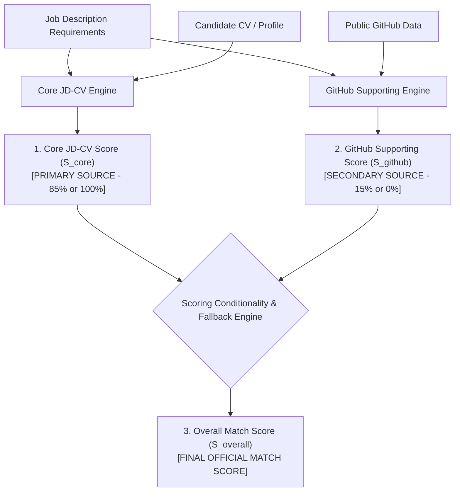

# MATCHING & SCORING ARCHITECTURE SPECIFICATION

Tài liệu này đặc tả Mô hình Tính điểm Đối sánh Chính thức (Official Scoring Model Architecture) của **AI Recruitment Platform**, bao gồm công thức toán học phân tách 3 thành phần điểm số, ma trận trọng số, quy tắc kích hoạt theo ngữ cảnh JD, Chiến lược Chuẩn hóa Theo Dữ liệu Khả thi (Available-Data Normalization Fallback Strategy), các ví dụ tính toán minh họa và tính khả xuất minh chứng.

---

## 1. MÔ HÌNH TÍNH ĐIỂM CHÍNH THỨC 3 THÀNH PHẦN (OFFICIAL 3-TIER SCORING MODEL)

Hệ thống phân biệt rõ ràng 3 chỉ số điểm số trong quá trình đối sánh:



---

## 2. CÔNG THỨC TOÁN HỌC VÀ TRỌNG SỐ (MATHEMATICAL FORMULATIONS)

### 2.1 Điểm Nòng cốt JD-CV ($S_{\text{core}} \in [0, 100]$)
Điểm nòng cốt đánh giá mức độ đáp ứng của CV đối với các yêu cầu trong JD:

$$S_{\text{core}} = 0.40 \cdot S_{\text{skill}} + 0.25 \cdot S_{\text{exp}} + 0.10 \cdot S_{\text{edu}} + 0.10 \cdot S_{\text{proj}} + 0.15 \cdot S_{\text{sem}}$$

* **$S_{\text{skill}}$ (40%):** Kỹ năng bắt buộc (Required Skills - 80% trọng số kỹ năng) và Kỹ năng ưu tiên (Preferred Skills - 20% trọng số kỹ năng). Áp dụng án phạt giảm 20% nếu tỷ lệ khớp Required Skills $< 50\%$.
* **$S_{\text{exp}}$ (25%):** Tỷ lệ số năm kinh nghiệm thực tế so với số năm JD yêu cầu tối thiểu.
* **$S_{\text{edu}}$ (10%):** Trình độ học vấn và chứng chỉ chuyên môn.
* **$S_{\text{proj}}$ (10%):** Mức độ tương quan nội dung dự án thực tế.
* **$S_{\text{sem}}$ (15%):** Khoảng cách Cosine Similarity giữa Vector Embeddings 1536 chiều của JD và CV trong `pgvector` ($S_{\text{sem}} = S_{\text{cosine}} \times 100$).

---

### 2.2 Điểm Hỗ trợ GitHub ($S_{\text{github}} \in [0, 100]$)
Điểm hỗ trợ đánh giá các minh chứng công khai quan sát được từ GitHub:

$$S_{\text{github}} = 0.40 \cdot S_{\text{gh\_lang}} + 0.35 \cdot S_{\text{gh\_tech}} + 0.15 \cdot S_{\text{gh\_act}} + 0.10 \cdot S_{\text{gh\_recency}}$$

| Thành phần GitHub | Trọng số | Mô tả tính toán Deterministic |
| :--- | :---: | :--- |
| **$S_{\text{gh\_lang}}$** (Language Match) | **40%** | Đối chiếu danh sách ngôn ngữ lập trình xuất hiện trong public repos với Required/Preferred Skills trong JD. |
| **$S_{\text{gh\_tech}}$** (Technology Evidence) | **35%** | Mức độ trùng khớp về Framework/Library/Topics trích xuất từ README và mô tả repository. |
| **$S_{\text{gh\_act}}$** (Activity Signal) | **15%** | Đánh giá mức độ hoạt động công khai quan sát được: `HIGH` (100%), `MODERATE` (75%), `LOW` (40%), `LIMITED_OBSERVABLE_ACTIVITY` (10%). |
| **$S_{\text{gh\_recency}}$** (Observable Recency) | **10%** | Thời gian công khai quan sát được gần nhất (VD: $\le 14$ ngày: 100%, $\le 60$ ngày: 80%, $> 60$ ngày: 40%). |

* **Quy tắc về Stars & Forks:** Số lượng Stars/Forks được ghi nhận làm chỉ số phụ phản ánh độ phổ biến dự án công khai (`Project Popularity Signal`), **TUYỆT ĐỐI KHÔNG** được chiếm ưu thế hay áp đảo $S_{\text{github}}$.

---

### 2.3 Điểm Tổng hợp Chính thức ($S_{\text{overall}} \in [0, 100]$)
Điểm tổng hợp chính thức được tính theo công thức:

$$S_{\text{overall}} = w_{\text{core}} \cdot S_{\text{core}} + w_{\text{github}} \cdot S_{\text{github}}$$

---

## 3. ĐIỀU KIỆN KÍCH HOẠT VÀ STRATEGY FALLBACK THEO DỮ LIỆU KHẢ THI (CONDITIONALITY & FALLBACK STRATEGY)

```mermaid
flowchart TD
    Start([Tính toán Điểm Match Result]) --> CheckTech{JD có yêu cầu Ngôn ngữ Lập trình / Tech Stack?}
    
    CheckTech -- No (Bài tuyển dụng Phi kỹ thuật: Marketing, Sales, HR, Finance) --> DeactivateGH[Vô hiệu hóa GitHub: w_core = 1.0, w_github = 0.0]
    DeactivateGH --> FormNonTech[S_overall = S_core]
    
    CheckTech -- Yes (Bài tuyển dụng Kỹ thuật) --> CheckGHData{Ứng viên có GitHub hợp lệ & Status SYNCED?}
    
    CheckGHData -- Yes --> ActivateGH[Kích hoạt GitHub: w_core = 0.85, w_github = 0.15]
    ActivateGH --> FormTech[S_overall = 0.85 * S_core + 0.15 * S_github]
    
    CheckGHData -- No (Không có GitHub / URL hỏng / Rate limit API) --> AvailableDataFallback[Available-Data Normalization Fallback: w_core = 1.0, w_github = 0.0]
    AvailableDataFallback --> FormFallback[S_overall = S_core | Ứng viên KHÔNG BỊ TRỪ ĐIỂM]
```

### 3.1 Giải trình Lý do Trọng số 85 / 15 (Rationale for 85/15 Weights)
* **Trọng số Core JD-CV ($w_{\text{core}} = 0.85$ / 85%):** Chiếm ưu thế tuyệt đối vì CV chứa thông tin toàn diện nhất về quá trình đào tạo, lịch sử công tác doanh nghiệp, dự án thực tế và kinh nghiệm làm việc (kể cả các dự án bảo mật nội bộ không public).
* **Trọng số GitHub ($w_{\text{github}} = 0.15$ / 15%):** Đủ lớn để tạo sự khác biệt tích cực cho các ứng viên có minh chứng mã nguồn mở mạnh mẽ, nhưng **không bao giờ vượt quá hay làm thay đổi bản chất** đánh giá từ hồ sơ CV chính.

### 3.2 Chiến lược Chuẩn hóa Theo Dữ liệu Khả thi (Available-Data Normalization Strategy)
* Khi Candidate không cung cấp GitHub, URL không hợp lệ, hoặc API GitHub bị quá tải (`status = UNAVAILABLE`):
  * **Trọng số tự động điều chỉnh:** $w_{\text{core}} = 1.0$, $w_{\text{github}} = 0.0$.
  * **Công thức Fallback:** $S_{\text{overall}} = S_{\text{core}}$.
  * **Cam kết Công bằng (Fairness Guarantee):** Candidate **KHÔNG BỊ PHẠT VỀ ĐIỂM 0**. Điểm nòng cốt JD-CV trực tiếp trở thành Điểm Tổng hợp.

---

## 4. VÍ DỤ TÍNH TOÁN CỤ THỂ (CONCRETE CALCULATION EXAMPLES)

### Ví dụ A: Job Kỹ thuật + GitHub Hợp lệ & Phù hợp cao
* **Thông tin:** Job tuyển Senior Java Spring Boot Developer. Candidate A có CV tốt và GitHub hoạt động mạnh mẽ.
* **Các chỉ số:**
  * Core JD-CV Score ($S_{\text{core}}$) $= 88.0\%$
  * GitHub Supporting Score ($S_{\text{github}}$) $= 92.0\%$ (Java ranked #1, Spring Boot repo evidence, Activity HIGH).
* **Tính toán:**
  $$S_{\text{overall}} = (0.85 \times 88.0) + (0.15 \times 92.0) = 74.8 + 13.8 = \mathbf{88.6\%}$$
* **Kết quả:** Phân loại **HIGH MATCH (88.6%)**. GitHub đóng góp thêm $+0.6\%$ nâng thứ hạng ứng viên một cách hợp lý.

### Ví dụ B: Job Kỹ thuật + Không có GitHub (Available-Data Fallback)
* **Thông tin:** Candidate B ứng tuyển cùng vị trí Senior Java Developer nhưng không cung cấp GitHub.
* **Các chỉ số:**
  * Core JD-CV Score ($S_{\text{core}}$) $= 88.0\%$
  * GitHub Status: `UNAVAILABLE` $\rightarrow$ Áp dụng Available-Data Fallback ($w_{\text{core}} = 1.0$).
* **Tính toán:**
  $$S_{\text{overall}} = 1.0 \times 88.0 = \mathbf{88.0\%}$$
* **Kết quả:** Phân loại **HIGH MATCH (88.0%)**. Candidate B không bị phạt điểm, giữ nguyên điểm nòng cốt.

### Ví dụ C: Job Phi Kỹ thuật (Marketing Manager) + Candidate có GitHub
* **Thông tin:** Job tuyển Trưởng phòng Marketing. Candidate C vô tình đính kèm GitHub URL cá nhân.
* **Các chỉ số:**
  * Core JD-CV Score ($S_{\text{core}}$) $= 92.0\%$
  * JD Context: Non-Technical Job $\rightarrow$ GitHub bị vô hiệu hóa ($w_{\text{github}} = 0.0$, $w_{\text{core}} = 1.0$).
* **Tính toán:**
  $$S_{\text{overall}} = 1.0 \times 92.0 = \mathbf{92.0\%}$$
* **Kết quả:** Phân loại **HIGH MATCH (92.0%)**. GitHub không làm sai lệch thứ hạng bài tuyển dụng phi kỹ thuật.

---

## 5. MINH CHỨNG VÀ TRUY XUẤT NGUỒN GỐC (EVIDENCE TRACEABILITY)

Mọi thành phần đóng góp vào điểm số bắt buộc phải được liên kết với bản ghi minh chứng thực tế:

```text
+-----------------------------------------------------------------------------------------+
| OVERALL MATCH SCORE: 88.6%                                                              |
| ├── 1. CORE JD-CV SCORE: 88.0% (Weight: 85%)                                           |
| │   ├── Skill Match (40%): Java (✓), Spring Boot (✓), PostgreSQL (✓), AWS (✗)           |
| │   └── Evidence: "Developed Java Spring Boot microservices..." (CV Page 1)            |
| │                                                                                       |
| └── 2. GITHUB SUPPORTING SIGNAL: 92.0% (Weight: 15%)                                    |
|     ├── Language Match (40%): Java ranked #1 (45% repo language distribution)          |
|     ├── Repo Evidence (35%): Repository 'spring-boot-ecommerce' (Match tech stack)     |
|     ├── Activity Signal (15%): HIGH (Latest observable activity: 14 days ago)           |
|     └── Recency (10%): Updated 14 days ago                                              |
+-----------------------------------------------------------------------------------------+
```
