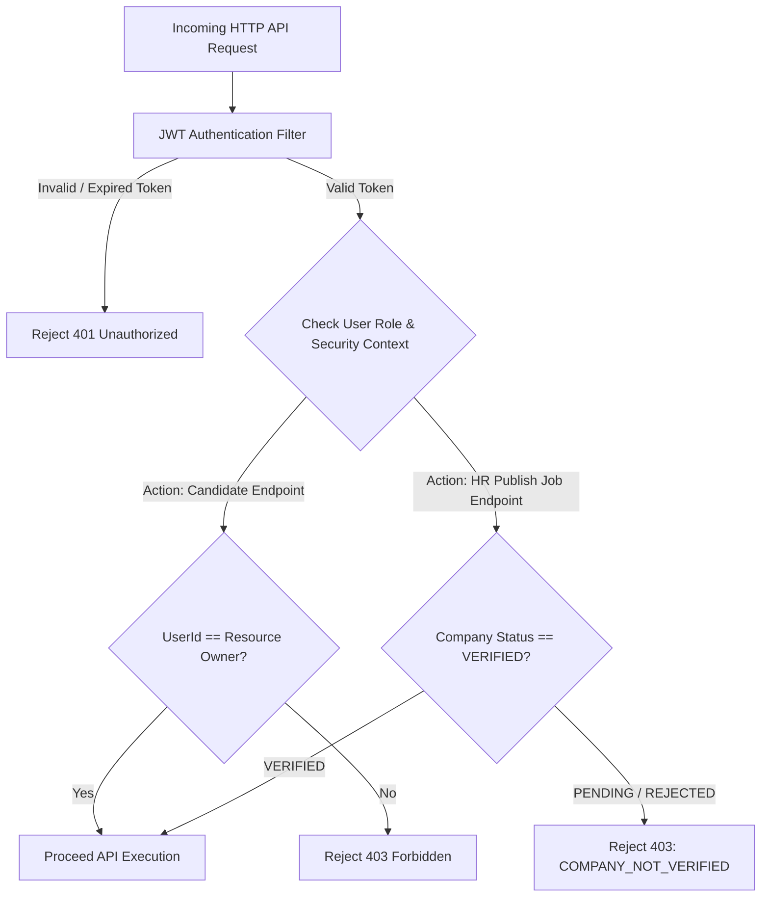

# SECURITY ARCHITECTURE SPECIFICATION (REVISED)

Tài liệu này đặc tả Kiến trúc Bảo mật (Security Architecture), Phân quyền Vai trò (RBAC Boundaries), Kiểm tra Xác minh Công ty (Company Verification Guards) và Cô lập Dữ liệu Người dùng.

---

## 1. PHÂN QUYỀN VAI TRÒ VÀ BẢO VỆ TÀI NGUYÊN (RBAC BOUNDARIES)

---

## 2. NGUYÊN TẮC CÔ LẬP NGHĨA VỤ NGUYÊN TẮC DỮ LIỆU (DATA PRIVACY BOUNDARIES)

1. **Candidate Privacy Boundary:** Candidate $A$ tuyệt đối không thể truy cập, xem hoặc chỉnh sửa CV/Profile của Candidate $B$.
2. **Company Job Boundary:** HR Công ty $X$ chỉ được xem danh sách ứng viên, báo cáo AI Matching và GitHub assessment thuộc về các bài tuyển dụng của Công ty $X$.
3. **Company Verification Enforcement:** 
   * Đăng ký HR mới khởi tạo trạng thái Công ty là `PENDING`.
   * HR chỉ có thể tạo bài đăng ở dạng `DRAFT`. Để đăng bài tuyển dụng chính thức (`PUBLISHED`), trạng thái công ty bắt buộc phải chuyển sang `VERIFIED`.
