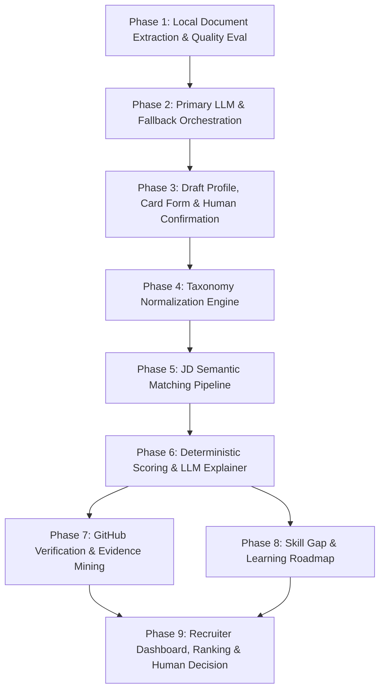

# MidCV Implementation Phases

Tài liệu này xác định lộ trình triển khai chi tiết cho hệ thống **AI Recruitment Platform / MidCV** theo 9 Phase kế thừa kiến trúc nguồn sự thật tại [CORE_PRODUCT_FLOW.md](file:///c:/Users/Khang/OneDrive/Desktop/SE121/ai-recruitment-platform/docs/CORE_PRODUCT_FLOW.md) và [DOMAIN_RULES.md](file:///c:/Users/Khang/OneDrive/Desktop/SE121/ai-recruitment-platform/docs/DOMAIN_RULES.md).

---

## Tổng quan các Phase

---

## Phase 1: Local Document Extraction & Quality Evaluation (AI Worker)

### Mục tiêu
Trích xuất toàn bộ văn bản thô từ file CV (PDF, DOCX, Ảnh) mà không gọi LLM bên ngoài, tính toán chỉ số chất lượng extraction và xác định phương pháp trích xuất (native text hay OCR).

### Phạm vi triển khai
1. **Document Parsers**:
   - `pdfplumber` / `pypdfium2` cho PDF text.
   - `python-docx` cho DOCX.
   - `pytesseract` / OCR engine cho ảnh (PNG, JPG) và PDF scan.
2. **Quality Evaluation Engine**:
   - Tính toán character count, word count, whitespace ratio, printable character ratio.
   - Kiểm tra ngưỡng chất lượng (Quality Flag: `PASSED`, `WARNING`, `FAILED`).
3. **Endpoint**:
   - `POST /internal/ai/cv/extract-text` trả về `raw_text`, `quality_metrics`, `extraction_method`.

### Deliverables
- Service parser trong `ai-worker/app/services/document_parser.py`.
- Unit test trong `ai-worker/tests/test_cv_text_extraction.py`.
- Tài liệu hướng dẫn tại `docs/cv-extraction-guide.md`.

---

## Phase 2: Primary LLM Structuring & Controlled Ollama Fallback (AI Worker)

### Mục tiêu
Chuyển đổi raw text thành schema JSON cấu trúc (`CVData`) thông qua Primary LLM tương thích OpenAI, có cơ chế Fallback sang Ollama local khi Primary gặp lỗi tạm thời (HTTP 5xx, timeout, connection drop).

### Phạm vi triển khai
1. **Primary LLM Client**:
   - Client tương thích OpenAI (`httpx` async), cấu hình qua `AI_WORKER_PRIMARY_LLM_BASE_URL`, `API_KEY`, `MODEL_ID`, `TIMEOUT`, `MAX_RETRIES`.
2. **Fallback Orchestrator**:
   - Kiểm tra phân loại lỗi (Lỗi cấu hình/401/404 -> Ném ngoại lệ ngay; Lỗi tạm thời 503/timeout/network -> Fallback Ollama).
   - Ollama local endpoint `AI_WORKER_OLLAMA_BASE_URL`, model `qwen2.5:7b` / `mistral`.
3. **Schema Validation**:
   - Pydantic model `CVData` kiểm tra tính hợp lệ của JSON cấu trúc.
4. **Endpoint**:
   - `POST /internal/ai/cv/parse-cv` nhận raw text hoặc file, trả về `CVData` có metadata `structured_by: PRIMARY | OLLAMA_FALLBACK`.

### Deliverables
- `ai-worker/app/services/llm_client.py` & `ai-worker/app/services/orchestration.py`.
- Unit & integration tests trong `ai-worker/tests/test_fallback_orchestration.py`.
- Tài liệu cấu hình tại `docs/llm-configuration-and-fallback.md`.
- Postman Collection tại `docs/postman/MidCV-LLM-Testing.postman_collection.json`.

---

## Phase 3: Candidate DRAFT Profile, Form Autofill & Human Confirmation (Backend & Frontend)

### Mục tiêu
Lưu trữ hồ sơ ở trạng thái `DRAFT`, tự động điền form trên UI với các thẻ lặp (Repeated Cards), cho phép ứng viên thêm, sửa, xóa, gắn nhãn nguồn gốc (`CV_EXTRACTED`, `USER_ADDED`), và chuyển trạng thái sang `USER_CONFIRMED`.

### Phạm vi triển khai
1. **Backend Entities & API**:
   - Lưu trữ `CandidateProfile` với trạng thái `status: DRAFT | CONFIRMED`.
   - Data lineage metadata cho từng field: `origin: CV_EXTRACTED | USER_ADDED | USER_CONFIRMED`.
   - Endpoint: `POST /api/v1/candidate/cv/upload`, `GET /api/v1/candidate/profile`, `PUT /api/v1/candidate/profile`, `POST /api/v1/candidate/profile/confirm`.
   - Bảo toàn file CV gốc trong storage (S3/Local file store), không ghi đè khi cập nhật form.
2. **Frontend UI**:
   - Màn hình chỉnh sửa CV với 9 section chuẩn.
   - Thẻ lặp linh hoạt (Add / Edit / Delete Card) cho: Kinh nghiệm làm việc, Dự án, Học vấn, Chứng chỉ, Ngôn ngữ.
   - Skill chips quản lý thêm / xóa.
   - Modal/nút xác nhận "Xác nhận hồ sơ" chuyển trạng thái và mở khóa luồng matching.

### Deliverables
- Backend JPA Entities, DTOs, Controllers trong `backend/src/main/java/com/platform/recruitment/candidate/`.
- Frontend Components trong `frontend/src/app/candidate/profile/` & `frontend/src/components/profile/`.
- E2E / Integration tests xác thực luồng tạo draft, chỉnh sửa và xác nhận hồ sơ.

---

## Phase 4: Skills & Occupations Taxonomy Normalization Engine (Backend & AI Worker)

### Mục tiêu
Chuẩn hóa toàn bộ kỹ năng và nghề nghiệp đã được ứng viên xác nhận về Canonical Taxonomy ID (dựa trên ESCO/O*NET chuẩn hóa cho thị trường CNTT Việt Nam), giải quyết vấn đề đồng nghĩa và đa ngôn ngữ (Tiếng Việt - Tiếng Anh).

### Phạm vi triển khai
1. **Taxonomy Database & Retrieval Pipeline**:
   - Database quản lý canonical skills, occupations, aliases (Việt - Anh), quan hệ cha - con, kỹ năng liên quan.
   - Layer 1: Exact Match (chuẩn hóa chữ thường, ký tự đặc biệt, trim whitespace).
   - Layer 2: Alias Match (bảng tra cứu từ đồng nghĩa).
   - Layer 3: Fuzzy Match (Levenshtein distance với threshold an toàn >= 0.85).
   - Layer 4: Semantic Top-K Retrieval (Vector Embedding cosine similarity).
2. **LLM Disambiguation Layer**:
   - Chỉ khi Top-K có nhiều ứng viên sát nhau hoặc không rõ ngữ cảnh, gửi Top-K nhỏ (3-5 items) sang LLM để disambiguate.
   - Cấm LLM tự tạo Taxonomy ID mới.
3. **Frontend Autocomplete**:
   - Tích hợp Taxonomy Autocomplete vào UI Skill Chip selector.

### Deliverables
- Taxonomy database schema & seed data tại `backend/src/main/resources/db/migration/`.
- Taxonomy service & normalization algorithm trong `ai-worker/app/services/taxonomy.py` hoặc Backend service.
- API `POST /internal/ai/taxonomy/normalize-skills`.

---

## Phase 5: Target JD Semantic Matching & Embedding Pipeline (AI Worker & Backend)

### Mục tiêu
Ứng viên chọn hoặc nộp đơn vào JD đích; hệ thống tính toán vector embedding ngữ nghĩa cho CV (đã được chuẩn hóa) và JD để đối sánh ngữ nghĩa đa chiều.

### Phạm vi triển khai
1. **JD Section Parser & Normalizer**:
   - Phân tách JD thành Requirements, Qualifications, Responsibilities.
   - Trích xuất và chuẩn hóa kỹ năng bắt buộc (Required Skills) và kỹ năng ưu tiên (Preferred Skills) theo Taxonomy.
2. **Embedding Generation**:
   - Tạo vector embedding cho Profile Summary, Work Experience narratives, Project descriptions và JD Requirements.
   - Vector dimension đồng nhất (ví dụ: `text-embedding-3-small` hoặc `bge-m3` local).
3. **Multi-Vector Semantic Similarity**:
   - Tính cosine similarity giữa từng section của CV và JD (Experience Match, Project Match, General Role Match).

### Deliverables
- `ai-worker/app/services/embedding.py` và `ai-worker/app/services/matching.py`.
- API `POST /internal/ai/matching/semantic-compare`.

---

## Phase 6: Deterministic Scoring Algorithm & LLM Explainer (Scoring Engine & LLM)

### Mục tiêu
Tính toán điểm số phù hợp (Match Score: 0 - 100) bằng thuật toán toán học tất định (deterministic), không dùng LLM để chấm điểm; sau đó dùng LLM để sinh văn bản giải thích dựa trên các reason codes và score breakdown.

### Phạm vi triển khai
1. **Deterministic Scoring Engine**:
   - Trọng số rõ ràng theo phiên bản (Algorithm v1.0):
     - Required Skills Match: 35%
     - Preferred Skills Match: 15%
     - Experience Duration & Seniority Match: 25%
     - Project Relevance: 15%
     - Education & Certifications: 10%
   - Tạo Score Breakdown chi tiết và Reason Codes (ví dụ: `REQ_SKILL_MISSING_DOCKER`, `EXP_EXCEEDS_REQUIREMENT`).
   - Cấm sử dụng các thuộc tính nhạy cảm (tuổi, giới tính, tôn giáo, ảnh đại diện).
2. **LLM Explainer**:
   - Nhận Score Breakdown và Reason Codes làm input, sinh tóm tắt giải thích trực quan, dễ hiểu cho ứng viên và nhà tuyển dụng.
   - LLM không được quyền tự thay đổi hay sửa điểm toán học.

### Deliverables
- Service chấm điểm toán học độc lập trong `backend/src/main/java/com/platform/recruitment/matching/ScoringEngine.java`.
- Integration API `POST /internal/ai/matching/explain-score`.
- Unit tests xác thực tính tất định (cùng input luôn ra cùng 1 output điểm số).

---

## Phase 7: GitHub Verification & Evidence Mining (Background Worker & AI Worker)

### Mục tiêu
Xác thực năng lực kỹ thuật thực tế của ứng viên thông qua GitHub public repository mà ứng viên cung cấp, trích xuất bằng chứng khách quan (Evidence) để đối chiếu với các kỹ năng đã khai báo.

### Phạm vi triển khai
1. **GitHub Ingestion Worker**:
   - Kết nối GitHub API (với rate-limit handling & token).
   - Kiểm tra tính tồn tại của Profile / Repositories.
   - Phân tích đóng góp: Commit history của ứng viên (không tính bot hoặc forks), Pull Requests, code language composition, issues.
2. **Evidence Extraction & Confidence Calculation**:
   - Trích xuất: Tần suất ngôn ngữ lập trình, cấu trúc thư mục, frameworks trong `package.json` / `pom.xml` / `requirements.txt`.
   - Tính toán `confidence_level` (`HIGH`, `MEDIUM`, `LOW`).
   - Gắn nhãn `GITHUB_VERIFIED` cho các kỹ năng có bằng chứng repository rõ ràng.
   - Đảm bảo GitHub chỉ là bằng chứng bổ sung (Evidence), không dùng làm điều kiện loại tuyệt đối và không dựa vào số sao (stars) ảo.

### Deliverables
- Service `backend/src/main/java/com/platform/recruitment/github/` hoặc `ai-worker/app/services/github_miner.py`.
- Schema lưu trữ GitHub Evidence gắn với từng kỹ năng của ứng viên.

---

## Phase 8: Skill Gap Breakdown & Tailored Roadmap Recommendations (Scoring Engine & LLM)

### Mục tiêu
Phân tích khoảng cách kỹ năng giữa hồ sơ ứng viên và JD đích cụ thể, phân loại thành 5 danh mục rõ ràng và tạo lộ trình học tập bổ sung kỹ năng thiếu.

### Phạm vi triển khai
1. **Skill Gap Analyzer (Scoring Engine)**:
   - Phân loại rõ ràng 5 nhóm:
     1. `MET`: Kỹ năng đã đáp ứng.
     2. `MISSING_MANDATORY`: Thiếu kỹ năng bắt buộc từ JD.
     3. `MISSING_PREFERRED`: Thiếu kỹ năng ưu tiên từ JD.
     4. `RELATED_TO_LEARN`: Kỹ năng liên quan nên học mở rộng.
     5. `EVIDENCE_MISSING`: Kỹ năng có khai báo nhưng chưa có bằng chứng xác thực.
   - Không tự động thêm kỹ năng được gợi ý vào hồ sơ ứng viên.
2. **LLM Roadmap Generator**:
   - Nhận danh sách `MISSING_MANDATORY` và `MISSING_PREFERRED` từ JD đích.
   - Tạo kế hoạch học tập theo thời gian (ví dụ: Lộ trình 4-8 tuần với chủ đề, dự án thực hành gợi ý).

### Deliverables
- Service phân loại Skill Gap trong `backend/src/main/java/com/platform/recruitment/matching/SkillGapService.java`.
- Prompt & service sinh Roadmap tại `ai-worker/app/services/roadmap.py`.
- UI hiển thị Skill Gap Matrix và Learning Roadmap trên Candidate Portal.

---

## Phase 9: Recruiter Dashboard, Ranking, Evidence View & Human Decision (Frontend & Backend)

### Mục tiêu
Cung cấp giao diện cho Nhà tuyển dụng xem danh sách ứng viên được xếp hạng theo điểm số tất định, xem chi tiết bằng chứng (CV trích xuất, GitHub evidence, Skill Gap breakdown) và thực hiện quyết định tuyển dụng cuối cùng (Human-in-the-loop).

### Phạm vi triển khai
1. **Recruiter Application Ranking**:
   - Danh sách ứng viên theo từng Job Posting, xếp thứ tự theo `match_score` (kèm bộ lọc theo kỹ năng bắt buộc, kinh nghiệm, GitHub confidence).
2. **Detailed Evidence & Audit Modal**:
   - Xem CV gốc (PDF viewer) song song với Hồ sơ đã xác nhận.
   - Xem Score Breakdown chi tiết (Toán học) và giải thích từ LLM.
   - Xem bằng chứng GitHub (repos, ngôn ngữ, commits đóng góp).
   - Xem Skill Gap matrix.
3. **Recruiter Decision Workflow**:
   - Recruiter thao tác thay đổi trạng thái ứng viên: `SHORTLISTED`, `INTERVIEW_SCHEDULED`, `OFFERED`, `REJECTED`.
   - Ghi lại lý do và audit log của người đưa ra quyết định.
   - Hệ thống tuyệt đối không tự động từ chối hoặc tuyển ứng viên.

### Deliverables
- Recruiter Controllers & Services trong `backend/src/main/java/com/platform/recruitment/recruiter/`.
- Recruiter Dashboard & Candidate Detail View trong `frontend/src/app/recruiter/`.
- E2E test cho toàn bộ luồng Recruiter từ mở JD đến quyết định ứng viên.
