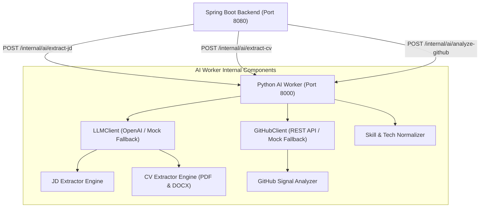

# PYTHON AI WORKER SPECIFICATION

Tài liệu này đặc tả Dịch vụ Python AI Worker Microservice (FastAPI, Python 3.11+), giao diện REST API nội bộ và mô hình trừu tượng LLMClient & GitHubClient.

---

## 1. TỔNG QUAN KIẾN TRÚC AI WORKER

---

## 2. API ROUTES NỘI BỘ (INTERNAL API ENDPOINTS)

* `GET /internal/ai/health`: Kiểm tra trạng thái hoạt động dịch vụ AI Worker.
* `POST /internal/ai/extract-jd`: Tiếp nhận raw JD, trích xuất trách nhiệm, kỹ năng `REQUIRED` vs `PREFERRED`, bằng cấp và trích dẫn minh chứng `RequirementEvidence`.
* `POST /internal/ai/extract-cv`: Tiếp nhận văn bản raw text hoặc file PDF/DOCX base64, trích xuất cấu trúc phân đoạn và liên kết minh chứng `CVEvidence` theo đúng `cv_version_id`.
* `POST /internal/ai/analyze-github`: Thu thập public repos, tính toán tỷ lệ % ngôn ngữ `Repository language distribution`, xác định `Activity Signal` định hình (`HIGH`, `MODERATE`, `LOW`, `LIMITED_OBSERVABLE_ACTIVITY`) và tổng hợp báo cáo đánh giá trung tính.
