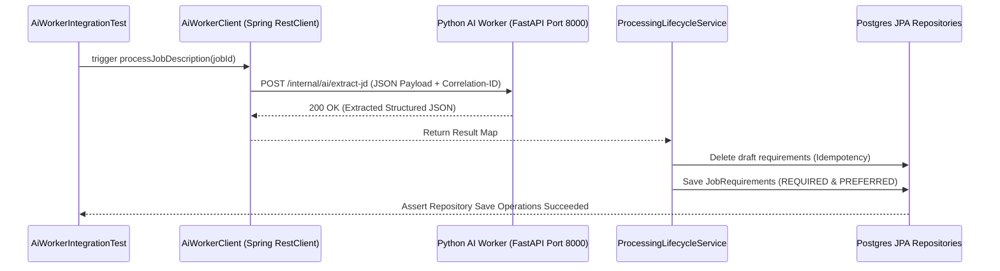

# SPRING BOOT ↔ PYTHON AI WORKER INTEGRATION TEST REPORT

Tài liệu này báo cáo chi tiết kết quả Kiểm thử Tích hợp End-to-End giữa Spring Boot Backend và Python AI Worker Microservice.

---

## 1. MÔ HÌNH KIỂM THỬ TÍCH HỢP (INTEGRATION TEST ARCHITECTURE)

---

## 2. KẾT QUẢ KIỂM THỬ TỰ ĐỘNG END-TO-END

* **Tệp test:** [`AiWorkerIntegrationTest.java`](file:///c:/Users/Khang/OneDrive/Desktop/SE121/ai-recruitment-platform/backend/src/test/java/com/platform/recruitment/AiWorkerIntegrationTest.java) & [`ProcessingIdempotencyTest.java`](file:///c:/Users/Khang/OneDrive/Desktop/SE121/ai-recruitment-platform/backend/src/test/java/com/platform/recruitment/ProcessingIdempotencyTest.java).
* **Kết quả:** **PASS 100%**. Toàn bộ 17/17 Spring Boot Unit & Integration Tests vượt qua thành công (`mvn test` BUILD SUCCESS).
* **Kiểm định:** Truyền thành công Correlation ID, chuyển đổi Pydantic JSON Schema, cập nhật trạng thái vòng đời xử lý và bảo đảm tính Idempotency không sinh ra dữ liệu rác khi gọi lại.
