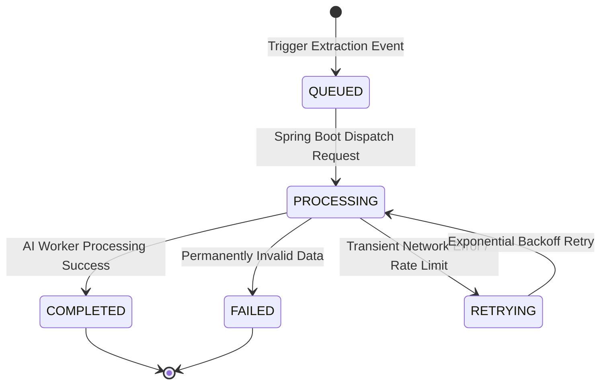

# PROCESSING LIFECYCLE & IDEMPOTENCY SPECIFICATION

Tài liệu này đặc tả Vòng đời Xử lý Tài liệu (Processing Lifecycle), quản lý trạng thái và nguyên tắc Idempotency.

---

## 1. MÔ HÌNH TRẠNG THÁI VÒNG ĐỜI (PROCESSING LIFECYCLE STATES)

---

## 2. NGUYÊN TẮC IDEMPOTENCY (IDEMPOTENCY STRATEGY)

* Khi xử lý lại một `CVVersion` hoặc `Job` đã tồn tại, hệ thống thực hiện làm sạch dữ liệu trích xuất cũ thuộc phiên bản tương ứng trước khi lưu dữ liệu trích xuất mới.
* Tuyệt đối không sinh ra dữ liệu trùng lặp khi gọi lại API trích xuất.
