# MatchJD Database Master Context Extraction & Full Repository Database Audit

**Project**: MatchJD  
**Research Topic**: *"Nền tảng tuyển dụng thông minh hỗ trợ đối sánh ngữ nghĩa JD – CV và xác thực năng lực qua GitHub"*  
**Audit Mode**: STRICTLY READ-ONLY — NO CODE OR DATABASE MODIFICATION  
**Database**: PostgreSQL 16.15 with Pgvector 0.8.6 & UUID-OSSP 1.1 on `airecruit_db`

---

## 1. Repository Discovery & Inventory

### 1.1 Persistence Infrastructure Files
- `docker-compose.yml`: Declares container `airecruit-postgres-pgvector` running image `pgvector/pgvector:pg16` on port `5432:5432` with database `airecruit_db`.
- `backend/src/main/resources/application.yml`: Defines Spring Boot datasource URL, driver, HikariCP pool, Hibernate/JPA settings (`ddl-auto: validate`), and Flyway migrations.
- `backend/src/main/resources/db/migration/`: Contains 5 versioned Flyway SQL migration scripts:
  - `V1__initial_schema.sql` (16,718 bytes)
  - `V2__cv_versioning_and_embedding_unification.sql` (1,206 bytes)
  - `V3__unique_candidate_job_application.sql` (224 bytes)
  - `V4__add_email_verification.sql` (1,134 bytes)
  - `V5__add_updated_at_to_email_verification_tokens.sql` (370 bytes)

### 1.2 JPA Entities (26 Entity Classes extending `BaseEntity`)
All entity classes inherit `id` (UUID, `@GeneratedValue(strategy = GenerationType.UUID)`), `created_at` (`@CreationTimestamp ZonedDateTime`), and `updated_at` (`@UpdateTimestamp ZonedDateTime`) from `com.platform.recruitment.common.BaseEntity`:
1. `com.platform.recruitment.user.User` (`users`)
2. `com.platform.recruitment.auth.EmailVerificationToken` (`email_verification_tokens`)
3. `com.platform.recruitment.candidate.CandidateProfile` (`candidate_profiles`)
4. `com.platform.recruitment.candidate.CandidateTargetIndustry` (`candidate_target_industries`)
5. `com.platform.recruitment.candidate.CandidateTargetRole` (`candidate_target_roles`)
6. `com.platform.recruitment.candidate.CandidateLanguage` (`candidate_languages`)
7. `com.platform.recruitment.company.Company` (`companies`)
8. `com.platform.recruitment.company.RecruiterProfile` (`recruiter_profiles`)
9. `com.platform.recruitment.cv.CV` (`cvs`)
10. `com.platform.recruitment.cv.CVVersion` (`cv_versions`)
11. `com.platform.recruitment.cv.CVSection` (`cv_sections`)
12. `com.platform.recruitment.job.Job` (`jobs`)
13. `com.platform.recruitment.job.JobRequirement` (`job_requirements`)
14. `com.platform.recruitment.application.Application` (`applications`)
15. `com.platform.recruitment.application.ApplicationCVSnapshot` (`application_cv_snapshots`)
16. `com.platform.recruitment.application.ApplicationQuestion` (`application_questions`)
17. `com.platform.recruitment.application.ApplicationAnswer` (`application_answers`)
18. `com.platform.recruitment.github.GitHubProfile` (`github_profiles`)
19. `com.platform.recruitment.github.GitHubRepository` (`github_repositories`)
20. `com.platform.recruitment.github.GitHubRepositoryLanguage` (`github_repository_languages`)
21. `com.platform.recruitment.github.GitHubRepositoryTopic` (`github_repository_topics`)
22. `com.platform.recruitment.github.GitHubAssessment` (`github_assessments`)
23. `com.platform.recruitment.matching.MatchResult` (`match_results`)
24. `com.platform.recruitment.matching.MatchFactor` (`match_factors`)
25. `com.platform.recruitment.matching.Evidence` (`evidences`)
26. `com.platform.recruitment.embedding.Embedding` (`embeddings`)

*Note*: In `V1__initial_schema.sql`, 5 auxiliary candidate tables were created (`candidate_skills`, `experiences`, `educations`, `projects`, `certifications`) but do not have dedicated Java `@Entity` models; their data is extracted/represented in unstructured/semi-structured form via CV Sections and embeddings.

### 1.3 Spring Data JPA Repositories (19 Interfaces)
1. `UserRepository` (`User`, `UUID`)
2. `EmailVerificationTokenRepository` (`EmailVerificationToken`, `UUID`)
3. `CandidateProfileRepository` (`CandidateProfile`, `UUID`)
4. `CandidateTargetIndustryRepository` (`CandidateTargetIndustry`, `UUID`)
5. `CandidateTargetRoleRepository` (`CandidateTargetRole`, `UUID`)
6. `CandidateLanguageRepository` (`CandidateLanguage`, `UUID`)
7. `CompanyRepository` (`Company`, `UUID`)
8. `RecruiterProfileRepository` (`RecruiterProfile`, `UUID`)
9. `CVRepository` (`CV`, `UUID`)
10. `CVVersionRepository` (`CVVersion`, `UUID`)
11. `CVSectionRepository` (`CVSection`, `UUID`)
12. `JobRepository` (`Job`, `UUID`)
13. `JobRequirementRepository` (`JobRequirement`, `UUID`)
14. `ApplicationRepository` (`Application`, `UUID`)
15. `ApplicationCVSnapshotRepository` (`ApplicationCVSnapshot`, `UUID`)
16. `GitHubProfileRepository` (`GitHubProfile`, `UUID`)
17. `GitHubRepositoryRepository` (`GitHubRepository`, `UUID`)
18. `GitHubRepositoryLanguageRepository` (`GitHubRepositoryLanguage`, `UUID`)
19. `GitHubRepositoryTopicRepository` (`GitHubRepositoryTopic`, `UUID`)
20. `GitHubAssessmentRepository` (`GitHubAssessment`, `UUID`)
21. `MatchResultRepository` (`MatchResult`, `UUID`)
22. `MatchFactorRepository` (`MatchFactor`, `UUID`)
23. `EvidenceRepository` (`Evidence`, `UUID`)
24. `EmbeddingRepository` (`Embedding`, `UUID`)

---

## 2. Database Connection Architecture

```
Spring Boot 3.x Application
   │
   ├── [Spring Security Filter Chain]
   │     └── JwtAuthenticationFilter -> Loads User from UserRepository
   │
   ├── [Spring Data JPA / Hibernate 6.x]
   │     ├── Dialect: org.hibernate.dialect.PostgreSQLDialect
   │     ├── ddl-auto: validate (Schema changes managed strictly by Flyway)
   │     └── format_sql: true
   │
   ├── [HikariCP Connection Pool]
   │     ├── maximum-pool-size: 10
   │     ├── minimum-idle: 5
   │     ├── idle-timeout: 300,000 ms (5 min)
   │     └── connection-timeout: 20,000 ms (20 s)
   │
   ├── [JDBC Driver]
   │     └── org.postgresql.Driver
   │
   ├── [Network Transport: TCP Port 5432]
   │     └── jdbc:postgresql://localhost:5432/airecruit_db
   │
   └── [PostgreSQL 16.15 Database Engine]
         ├── Extensions: uuid-ossp (1.1), vector (0.8.6), plpgsql (1.0)
         ├── Database: airecruit_db
         ├── Schema: public
         └── Flyway Table: flyway_schema_history
```

### 2.1 Configuration Parameters (Masked)
- **Database Engine**: PostgreSQL 16.15 (Debian 16.15-1.pgdg12+2, x86_64-pc-linux-gnu)
- **Pgvector Extension**: pgvector 0.8.6
- **UUID Extension**: uuid-ossp 1.1
- **Driver**: `org.postgresql.Driver`
- **Datasource URL**: `${DATABASE_URL:jdbc:postgresql://localhost:5432/airecruit_db}`
- **Username**: `${DATABASE_USERNAME:postgres}`
- **Password**: `[PROTECTED - Configured via env DATABASE_PASSWORD]`
- **Active Profile**: `dev`
- **ORM / JPA Provider**: Hibernate ORM 6.x via Spring Data JPA
- **Hibernate DDL Auto**: `validate` (Strictly validates schema matches entity mappings without altering tables)
- **Migration Manager**: Flyway (`baseline-on-migrate: true`, locations: `classpath:db/migration`)
- **Connection Pool**: HikariCP (Max: 10, Min Idle: 5, Conn Timeout: 20s, Idle Timeout: 300s)
- **Transaction Management**: Spring Declarative `@Transactional` (Proxy-based, Read-Committed isolation)

---

## 3. Complete Schema Extraction & Data Dictionary

The live database contains **32 relations**: 31 business/domain tables and 1 Flyway migration history table.

### 3.1 `users`
- **Purpose**: Core identity authentication and role authorization.
- **PK**: `id` UUID (`uuid_generate_v4()`)
- **Columns**:
  - `id`: UUID NOT NULL PK DEFAULT uuid_generate_v4()
  - `email`: VARCHAR(255) NOT NULL UNIQUE
  - `password_hash`: VARCHAR(255) NOT NULL
  - `role`: VARCHAR(50) NOT NULL CHECK (`role IN ('CANDIDATE', 'HR', 'ADMIN')`)
  - `is_active`: BOOLEAN DEFAULT TRUE
  - `email_verified`: BOOLEAN NOT NULL DEFAULT FALSE (Added in V4)
  - `created_at`: TIMESTAMP WITH TIME ZONE DEFAULT CURRENT_TIMESTAMP
  - `updated_at`: TIMESTAMP WITH TIME ZONE DEFAULT CURRENT_TIMESTAMP
- **Constraints**: PK `users_pkey`, UNIQUE `users_email_key`, CHECK `users_role_check`
- **Indexes**: `idx_users_email` ON (email), `users_email_key` UNIQUE (email)
- **Foreign Keys**: Referenced by `recruiter_profiles(user_id)`, `candidate_profiles(user_id)`, `email_verification_tokens(user_id)`.

### 3.2 `email_verification_tokens` (Added in V4, Updated in V5)
- **Purpose**: High-security email activation tokens with 24-hour expiration window and single-use audit trail.
- **PK**: `id` UUID (`uuid_generate_v4()`)
- **Columns**:
  - `id`: UUID NOT NULL PK DEFAULT uuid_generate_v4()
  - `user_id`: UUID NOT NULL REFERENCES `users(id)` ON DELETE CASCADE
  - `token_hash`: VARCHAR(255) NOT NULL UNIQUE
  - `expires_at`: TIMESTAMP WITH TIME ZONE NOT NULL
  - `used_at`: TIMESTAMP WITH TIME ZONE NULL
  - `created_at`: TIMESTAMP WITH TIME ZONE DEFAULT CURRENT_TIMESTAMP
  - `updated_at`: TIMESTAMP WITH TIME ZONE DEFAULT CURRENT_TIMESTAMP (Added in V5)
- **Constraints**: PK `email_verification_tokens_pkey`, UNIQUE `email_verification_tokens_token_hash_key`, FK `users(id)` ON DELETE CASCADE
- **Indexes**: `idx_evt_user_id` ON (user_id), `idx_evt_token_hash` ON (token_hash), `email_verification_tokens_token_hash_key` UNIQUE (token_hash)

### 3.3 `companies`
- **Purpose**: Enterprise legal identity and trust verification status.
- **PK**: `id` UUID (`uuid_generate_v4()`)
- **Columns**:
  - `id`: UUID NOT NULL PK DEFAULT uuid_generate_v4()
  - `name`: VARCHAR(255) NOT NULL
  - `tax_code`: VARCHAR(100) NULL
  - `website`: VARCHAR(255) NULL
  - `size`: VARCHAR(50) NULL
  - `industry`: VARCHAR(100) NULL
  - `description`: TEXT NULL
  - `verification_status`: VARCHAR(50) DEFAULT 'PENDING' CHECK (`verification_status IN ('PENDING', 'VERIFIED', 'REJECTED')`)
  - `created_at`: TIMESTAMP WITH TIME ZONE DEFAULT CURRENT_TIMESTAMP
  - `updated_at`: TIMESTAMP WITH TIME ZONE DEFAULT CURRENT_TIMESTAMP
- **Constraints**: PK `companies_pkey`, CHECK `companies_verification_status_check`
- **Indexes**: `idx_companies_verification` ON (verification_status)
- **Foreign Keys**: Referenced by `recruiter_profiles(company_id)` ON DELETE SET NULL, `jobs(company_id)` ON DELETE CASCADE.

### 3.4 `recruiter_profiles`
- **Purpose**: HR recruiter personal profile associated with a User account and a Company.
- **PK**: `id` UUID (`uuid_generate_v4()`)
- **Columns**:
  - `id`: UUID NOT NULL PK DEFAULT uuid_generate_v4()
  - `user_id`: UUID NOT NULL UNIQUE REFERENCES `users(id)` ON DELETE CASCADE
  - `company_id`: UUID NULL REFERENCES `companies(id)` ON DELETE SET NULL
  - `full_name`: VARCHAR(255) NOT NULL
  - `phone`: VARCHAR(50) NULL
  - `created_at`: TIMESTAMP WITH TIME ZONE DEFAULT CURRENT_TIMESTAMP
  - `updated_at`: TIMESTAMP WITH TIME ZONE DEFAULT CURRENT_TIMESTAMP
- **Constraints**: PK `recruiter_profiles_pkey`, UNIQUE `recruiter_profiles_user_id_key`, FK `users(id)` ON DELETE CASCADE, FK `companies(id)` ON DELETE SET NULL

### 3.5 `candidate_profiles`
- **Purpose**: Candidate professional identity, target careers, and external links.
- **PK**: `id` UUID (`uuid_generate_v4()`)
- **Columns**:
  - `id`: UUID NOT NULL PK DEFAULT uuid_generate_v4()
  - `user_id`: UUID NOT NULL UNIQUE REFERENCES `users(id)` ON DELETE CASCADE
  - `full_name`: VARCHAR(255) NOT NULL
  - `age`: INT NULL
  - `target_industry`: VARCHAR(100) NULL
  - `phone`: VARCHAR(50) NULL
  - `headline`: VARCHAR(255) NULL
  - `bio`: TEXT NULL
  - `github_url`: VARCHAR(255) NULL
  - `portfolio_url`: VARCHAR(255) NULL
  - `created_at`: TIMESTAMP WITH TIME ZONE DEFAULT CURRENT_TIMESTAMP
  - `updated_at`: TIMESTAMP WITH TIME ZONE DEFAULT CURRENT_TIMESTAMP
- **Constraints**: PK `candidate_profiles_pkey`, UNIQUE `candidate_profiles_user_id_key`, FK `users(id)` ON DELETE CASCADE

### 3.6 `candidate_target_industries`
- **Purpose**: 1:N multi-industry targeting for candidates (e.g. Technology, Finance, E-commerce).
- **PK**: `id` UUID (`uuid_generate_v4()`)
- **Columns**: `id` UUID PK, `candidate_id` UUID NOT NULL REFERENCES `candidate_profiles(id)` ON DELETE CASCADE, `industry_name` VARCHAR(100) NOT NULL, `is_primary` BOOLEAN DEFAULT FALSE, `created_at`, `updated_at`.

### 3.7 `candidate_target_roles`
- **Purpose**: 1:N desired job roles for candidates.
- **PK**: `id` UUID (`uuid_generate_v4()`)
- **Columns**: `id` UUID PK, `candidate_id` UUID NOT NULL REFERENCES `candidate_profiles(id)` ON DELETE CASCADE, `role_title` VARCHAR(100) NOT NULL, `created_at`, `updated_at`.

### 3.8 `candidate_languages`
- **Purpose**: 1:N spoken/written human languages and proficiencies.
- **PK**: `id` UUID (`uuid_generate_v4()`)
- **Columns**: `id` UUID PK, `candidate_id` UUID NOT NULL REFERENCES `candidate_profiles(id)` ON DELETE CASCADE, `language_name` VARCHAR(100) NOT NULL, `proficiency_level` VARCHAR(50) DEFAULT 'INTERMEDIATE', `created_at`, `updated_at`.

### 3.9 `cvs`
- **Purpose**: High-level candidate CV container representing a curriculum vitae document.
- **PK**: `id` UUID (`uuid_generate_v4()`)
- **Columns**:
  - `id`: UUID NOT NULL PK DEFAULT uuid_generate_v4()
  - `candidate_id`: UUID NOT NULL REFERENCES `candidate_profiles(id)` ON DELETE CASCADE
  - `title`: VARCHAR(255) NOT NULL
  - `creation_path`: VARCHAR(50) NOT NULL CHECK (`creation_path IN ('UPLOAD', 'BUILDER')`)
  - `target_industry`: VARCHAR(100) NULL
  - `file_name`: VARCHAR(255) NULL
  - `file_path`: VARCHAR(500) NULL
  - `file_type`: VARCHAR(50) NULL
  - `file_size`: INT NULL
  - `status`: VARCHAR(50) DEFAULT 'PENDING_PARSING'
  - `raw_text`: TEXT NULL
  - `is_default`: BOOLEAN DEFAULT FALSE
  - `created_at`: TIMESTAMP WITH TIME ZONE DEFAULT CURRENT_TIMESTAMP
  - `updated_at`: TIMESTAMP WITH TIME ZONE DEFAULT CURRENT_TIMESTAMP
- **Constraints**: PK `cvs_pkey`, CHECK `cvs_creation_path_check`, FK `candidate_profiles(id)` ON DELETE CASCADE
- **Indexes**: `idx_cvs_candidate` ON (candidate_id)

### 3.10 `cv_versions`
- **Purpose**: Immutable historical revisions of a CV document.
- **PK**: `id` UUID (`uuid_generate_v4()`)
- **Columns**:
  - `id`: UUID NOT NULL PK DEFAULT uuid_generate_v4()
  - `cv_id`: UUID NOT NULL REFERENCES `cvs(id)` ON DELETE CASCADE
  - `version_number`: INT NOT NULL
  - `title`: VARCHAR(255) NOT NULL
  - `raw_text_content`: TEXT NULL
  - `structured_json_content`: TEXT NULL
  - `created_at`: TIMESTAMP WITH TIME ZONE DEFAULT CURRENT_TIMESTAMP
  - `updated_at`: TIMESTAMP WITH TIME ZONE DEFAULT CURRENT_TIMESTAMP
- **Constraints**: PK `cv_versions_pkey`, FK `cvs(id)` ON DELETE CASCADE

### 3.11 `cv_sections` (Updated in V2)
- **Purpose**: Granular modular sections of a CV version (EXPERIENCE, EDUCATION, SKILLS, SUMMARY, PROJECTS).
- **PK**: `id` UUID (`uuid_generate_v4()`)
- **Columns**:
  - `id`: UUID NOT NULL PK DEFAULT uuid_generate_v4()
  - `cv_version_id`: UUID NOT NULL REFERENCES `cv_versions(id)` ON DELETE CASCADE (Refined in V2 from `cv_id`)
  - `section_type`: VARCHAR(50) NOT NULL
  - `content`: TEXT NOT NULL
  - `created_at`: TIMESTAMP WITH TIME ZONE DEFAULT CURRENT_TIMESTAMP
  - `updated_at`: TIMESTAMP WITH TIME ZONE DEFAULT CURRENT_TIMESTAMP
- **Constraints**: PK `cv_sections_pkey`, FK `cv_versions(id)` ON DELETE CASCADE

### 3.12 `candidate_skills` (Baseline V1 Auxiliary)
- **PK**: `id` UUID. `candidate_id` UUID FK -> `candidate_profiles(id)` ON DELETE CASCADE, `skill_name` VARCHAR(100), `normalized_name` VARCHAR(100), `years_exp` INT DEFAULT 0.

### 3.13 `experiences` (Baseline V1 Auxiliary)
- **PK**: `id` UUID. `candidate_id` UUID FK -> `candidate_profiles(id)` ON DELETE CASCADE, `company_name` VARCHAR(255), `position` VARCHAR(255), `start_date` DATE, `end_date` DATE, `is_current` BOOLEAN DEFAULT FALSE, `description` TEXT.

### 3.14 `educations` (Baseline V1 Auxiliary)
- **PK**: `id` UUID. `candidate_id` UUID FK -> `candidate_profiles(id)` ON DELETE CASCADE, `institution` VARCHAR(255), `degree` VARCHAR(100), `field_of_study` VARCHAR(100), `start_year` INT, `end_year` INT.

### 3.15 `projects` (Baseline V1 Auxiliary)
- **PK**: `id` UUID. `candidate_id` UUID FK -> `candidate_profiles(id)` ON DELETE CASCADE, `name` VARCHAR(255), `role` VARCHAR(100), `description` TEXT, `tech_stack` VARCHAR(500).

### 3.16 `certifications` (Baseline V1 Auxiliary)
- **PK**: `id` UUID. `candidate_id` UUID FK -> `candidate_profiles(id)` ON DELETE CASCADE, `name` VARCHAR(255), `issuing_organization` VARCHAR(255), `issue_year` INT.

### 3.17 `jobs`
- **Purpose**: Job Description (JD) postings created by recruiters for a company.
- **PK**: `id` UUID (`uuid_generate_v4()`)
- **Columns**:
  - `id`: UUID NOT NULL PK DEFAULT uuid_generate_v4()
  - `company_id`: UUID NOT NULL REFERENCES `companies(id)` ON DELETE CASCADE
  - `title`: VARCHAR(255) NOT NULL
  - `industry`: VARCHAR(100) NOT NULL
  - `seniority`: VARCHAR(50) NOT NULL
  - `status`: VARCHAR(50) DEFAULT 'DRAFT' CHECK (`status IN ('DRAFT', 'PUBLISHED', 'CLOSED')`)
  - `min_salary`: DECIMAL(12, 2) NULL
  - `max_salary`: DECIMAL(12, 2) NULL
  - `location`: VARCHAR(255) NULL
  - `employment_type`: VARCHAR(50) NULL
  - `description`: TEXT NOT NULL
  - `created_at`: TIMESTAMP WITH TIME ZONE DEFAULT CURRENT_TIMESTAMP
  - `updated_at`: TIMESTAMP WITH TIME ZONE DEFAULT CURRENT_TIMESTAMP
- **Constraints**: PK `jobs_pkey`, CHECK `jobs_status_check`, FK `companies(id)` ON DELETE CASCADE
- **Indexes**: `idx_jobs_company` ON (company_id), `idx_jobs_status` ON (status), `idx_jobs_industry` ON (industry)

### 3.18 `job_requirements`
- **Purpose**: Atomic skill requirements for a Job, partitioned into REQUIRED and PREFERRED gates.
- **PK**: `id` UUID (`uuid_generate_v4()`)
- **Columns**:
  - `id`: UUID NOT NULL PK DEFAULT uuid_generate_v4()
  - `job_id`: UUID NOT NULL REFERENCES `jobs(id)` ON DELETE CASCADE
  - `skill_name`: VARCHAR(100) NOT NULL
  - `requirement_type`: VARCHAR(50) NOT NULL CHECK (`requirement_type IN ('REQUIRED', 'PREFERRED')`)
  - `min_years_exp`: INT DEFAULT 0
  - `created_at`: TIMESTAMP WITH TIME ZONE DEFAULT CURRENT_TIMESTAMP
  - `updated_at`: TIMESTAMP WITH TIME ZONE DEFAULT CURRENT_TIMESTAMP
- **Constraints**: PK `job_requirements_pkey`, CHECK `job_requirements_requirement_type_check`, FK `jobs(id)` ON DELETE CASCADE

### 3.19 `applications` (Updated in V2 & V3)
- **Purpose**: Job application submitted by a candidate, binding Candidate, Job, CV, and specific CVVersion.
- **PK**: `id` UUID (`uuid_generate_v4()`)
- **Columns**:
  - `id`: UUID NOT NULL PK DEFAULT uuid_generate_v4()
  - `job_id`: UUID NOT NULL REFERENCES `jobs(id)` ON DELETE CASCADE
  - `candidate_id`: UUID NOT NULL REFERENCES `candidate_profiles(id)` ON DELETE CASCADE
  - `applied_cv_id`: UUID NULL REFERENCES `cvs(id)` ON DELETE SET NULL
  - `applied_cv_version_id`: UUID NULL REFERENCES `cv_versions(id)` ON DELETE SET NULL (Added in V2)
  - `status`: VARCHAR(50) DEFAULT 'SUBMITTED' CHECK (`status IN ('SUBMITTED', 'REVIEWED', 'MATCHED')`)
  - `applied_at`: TIMESTAMP WITH TIME ZONE DEFAULT CURRENT_TIMESTAMP
  - `created_at`: TIMESTAMP WITH TIME ZONE DEFAULT CURRENT_TIMESTAMP
  - `updated_at`: TIMESTAMP WITH TIME ZONE DEFAULT CURRENT_TIMESTAMP
- **Constraints**: PK `applications_pkey`, UNIQUE `uk_candidate_job (candidate_id, job_id)` (Added in V3), FK `jobs(id)` ON DELETE CASCADE, FK `candidate_profiles(id)` ON DELETE CASCADE, FK `cvs(id)` ON DELETE SET NULL, FK `cv_versions(id)` ON DELETE SET NULL
- **Indexes**: `idx_applications_job` ON (job_id), `idx_applications_candidate` ON (candidate_id), `uk_candidate_job` UNIQUE (candidate_id, job_id)

### 3.20 `application_cv_snapshots`
- **Purpose**: Immutable snapshot of the exact CV text and structured JSON frozen at the instant of application submission.
- **PK**: `id` UUID (`uuid_generate_v4()`)
- **Columns**:
  - `id`: UUID NOT NULL PK DEFAULT uuid_generate_v4()
  - `application_id`: UUID NOT NULL UNIQUE REFERENCES `applications(id)` ON DELETE CASCADE
  - `cv_title`: VARCHAR(255) NOT NULL
  - `raw_text_snapshot`: TEXT NOT NULL
  - `structured_json_snapshot`: TEXT NOT NULL
  - `snapshot_created_at`: TIMESTAMP WITH TIME ZONE DEFAULT CURRENT_TIMESTAMP
  - `created_at`: TIMESTAMP WITH TIME ZONE DEFAULT CURRENT_TIMESTAMP
  - `updated_at`: TIMESTAMP WITH TIME ZONE DEFAULT CURRENT_TIMESTAMP
- **Constraints**: PK `application_cv_snapshots_pkey`, UNIQUE `application_cv_snapshots_application_id_key`, FK `applications(id)` ON DELETE CASCADE

### 3.21 `application_questions`
- **Purpose**: Screening questions configured by recruiters on a Job.
- **PK**: `id` UUID (`uuid_generate_v4()`)
- **Columns**: `id` UUID PK, `job_id` UUID NOT NULL REFERENCES `jobs(id)` ON DELETE CASCADE, `question_text` TEXT NOT NULL, `is_required` BOOLEAN DEFAULT TRUE, `created_at`, `updated_at`.

### 3.22 `application_answers`
- **Purpose**: Answers submitted by a candidate to specific job screening questions.
- **PK**: `id` UUID (`uuid_generate_v4()`)
- **Columns**: `id` UUID PK, `application_id` UUID NOT NULL REFERENCES `applications(id)` ON DELETE CASCADE, `question_id` UUID NOT NULL REFERENCES `application_questions(id)` ON DELETE CASCADE, `answer_text` TEXT NOT NULL, `created_at`, `updated_at`.

### 3.23 `github_profiles`
- **Purpose**: Candidate GitHub metadata, sync state, and overall observable activity signal.
- **PK**: `id` UUID (`uuid_generate_v4()`)
- **Columns**:
  - `id`: UUID NOT NULL PK DEFAULT uuid_generate_v4()
  - `candidate_id`: UUID NOT NULL UNIQUE REFERENCES `candidate_profiles(id)` ON DELETE CASCADE
  - `username`: VARCHAR(100) NOT NULL
  - `github_url`: VARCHAR(255) NOT NULL
  - `public_repos_count`: INT DEFAULT 0
  - `status`: VARCHAR(50) DEFAULT 'SYNCED' CHECK (`status IN ('SYNCED', 'SYNCING', 'FAILED', 'UNAVAILABLE')`)
  - `activity_signal`: VARCHAR(50) NULL CHECK (`activity_signal IN ('HIGH', 'MODERATE', 'LOW', 'LIMITED_OBSERVABLE_ACTIVITY')`)
  - `latest_activity_at`: TIMESTAMP WITH TIME ZONE NULL
  - `observation_window_days`: INT DEFAULT 180
  - `calculated_at`: TIMESTAMP WITH TIME ZONE NULL
  - `synced_at`: TIMESTAMP WITH TIME ZONE DEFAULT CURRENT_TIMESTAMP
  - `created_at`: TIMESTAMP WITH TIME ZONE DEFAULT CURRENT_TIMESTAMP
  - `updated_at`: TIMESTAMP WITH TIME ZONE DEFAULT CURRENT_TIMESTAMP
- **Constraints**: PK `github_profiles_pkey`, UNIQUE `github_profiles_candidate_id_key`, CHECK `github_profiles_status_check`, CHECK `github_profiles_activity_signal_check`, FK `candidate_profiles(id)` ON DELETE CASCADE

### 3.24 `github_repositories`
- **Purpose**: Public repositories associated with a candidate's GitHub profile.
- **PK**: `id` UUID (`uuid_generate_v4()`)
- **Columns**:
  - `id`: UUID NOT NULL PK DEFAULT uuid_generate_v4()
  - `github_profile_id`: UUID NOT NULL REFERENCES `github_profiles(id)` ON DELETE CASCADE
  - `name`: VARCHAR(255) NOT NULL
  - `repo_url`: VARCHAR(255) NOT NULL
  - `description`: TEXT NULL
  - `primary_language`: VARCHAR(100) NULL
  - `stars_count`: INT DEFAULT 0
  - `forks_count`: INT DEFAULT 0
  - `is_archived`: BOOLEAN DEFAULT FALSE
  - `updated_at_github`: TIMESTAMP WITH TIME ZONE NULL
  - `created_at_github`: TIMESTAMP WITH TIME ZONE NULL
  - `fetched_at`: TIMESTAMP WITH TIME ZONE DEFAULT CURRENT_TIMESTAMP
  - `created_at`: TIMESTAMP WITH TIME ZONE DEFAULT CURRENT_TIMESTAMP
  - `updated_at`: TIMESTAMP WITH TIME ZONE DEFAULT CURRENT_TIMESTAMP
- **Constraints**: PK `github_repositories_pkey`, FK `github_profiles(id)` ON DELETE CASCADE

### 3.25 `github_repository_languages`
- **Purpose**: Byte breakdown and percentage ratio of programming languages in a repository.
- **PK**: `id` UUID (`uuid_generate_v4()`)
- **Columns**: `id` UUID PK, `repository_id` UUID NOT NULL REFERENCES `github_repositories(id)` ON DELETE CASCADE, `language_name` VARCHAR(100) NOT NULL, `bytes_count` BIGINT DEFAULT 0, `percentage_ratio` DECIMAL(5, 2) DEFAULT 0.00, `created_at`, `updated_at`.

### 3.26 `github_repository_topics`
- **Purpose**: Repository topic tags (e.g. `spring-boot`, `machine-learning`, `docker`).
- **PK**: `id` UUID (`uuid_generate_v4()`)
- **Columns**: `id` UUID PK, `repository_id` UUID NOT NULL REFERENCES `github_repositories(id)` ON DELETE CASCADE, `topic_name` VARCHAR(100) NOT NULL, `created_at`, `updated_at`.

### 3.27 `github_assessments`
- **Purpose**: AI analysis summary and rating of candidate's open-source activity.
- **PK**: `id` UUID (`uuid_generate_v4()`)
- **Columns**:
  - `id`: UUID NOT NULL PK DEFAULT uuid_generate_v4()
  - `github_profile_id`: UUID NOT NULL UNIQUE REFERENCES `github_profiles(id)` ON DELETE CASCADE
  - `summary_notes`: TEXT NULL
  - `language_rank_summary`: TEXT NULL
  - `overall_supporting_rating`: VARCHAR(50) NULL
  - `evaluated_at`: TIMESTAMP WITH TIME ZONE DEFAULT CURRENT_TIMESTAMP
  - `created_at`: TIMESTAMP WITH TIME ZONE DEFAULT CURRENT_TIMESTAMP
  - `updated_at`: TIMESTAMP WITH TIME ZONE DEFAULT CURRENT_TIMESTAMP
- **Constraints**: PK `github_assessments_pkey`, UNIQUE `github_assessments_github_profile_id_key`, FK `github_profiles(id)` ON DELETE CASCADE

### 3.28 `match_results`
- **Purpose**: Holistic matching score between an Application (Candidate CV) and a Job Description.
- **PK**: `id` UUID (`uuid_generate_v4()`)
- **Columns**:
  - `id`: UUID NOT NULL PK DEFAULT uuid_generate_v4()
  - `application_id`: UUID NOT NULL UNIQUE REFERENCES `applications(id)` ON DELETE CASCADE
  - `core_score`: DECIMAL(5, 2) NOT NULL (JD-CV score)
  - `github_score`: DECIMAL(5, 2) NULL (Supporting signal)
  - `overall_score`: DECIMAL(5, 2) NOT NULL (Blended composite score)
  - `core_weight`: DECIMAL(3, 2) DEFAULT 0.85
  - `github_weight`: DECIMAL(3, 2) DEFAULT 0.15
  - `is_github_active`: BOOLEAN DEFAULT TRUE
  - `github_fallback_applied`: BOOLEAN DEFAULT FALSE
  - `required_skills_total`: INT DEFAULT 0
  - `required_skills_matched`: INT DEFAULT 0
  - `required_skills_missing`: INT DEFAULT 0
  - `preferred_skills_total`: INT DEFAULT 0
  - `preferred_skills_matched`: INT DEFAULT 0
  - `preferred_skills_missing`: INT DEFAULT 0
  - `matching_algorithm_version`: VARCHAR(50) DEFAULT 'v1.0'
  - `status`: VARCHAR(50) DEFAULT 'COMPLETED'
  - `ai_summary`: TEXT NULL
  - `calculated_at`: TIMESTAMP WITH TIME ZONE DEFAULT CURRENT_TIMESTAMP
  - `created_at`: TIMESTAMP WITH TIME ZONE DEFAULT CURRENT_TIMESTAMP
  - `updated_at`: TIMESTAMP WITH TIME ZONE DEFAULT CURRENT_TIMESTAMP
- **Constraints**: PK `match_results_pkey`, UNIQUE `match_results_application_id_key`, FK `applications(id)` ON DELETE CASCADE
- **Indexes**: `idx_match_results_overall` ON (overall_score DESC), `match_results_application_id_key` UNIQUE (application_id)

### 3.29 `match_factors`
- **Purpose**: Granular sub-scores and weights contributing to `match_results` (Skill, Experience, Education, Project, Semantic, GitHub).
- **PK**: `id` UUID (`uuid_generate_v4()`)
- **Columns**:
  - `id`: UUID NOT NULL PK DEFAULT uuid_generate_v4()
  - `match_result_id`: UUID NOT NULL REFERENCES `match_results(id)` ON DELETE CASCADE
  - `source_type`: VARCHAR(50) NOT NULL CHECK (`source_type IN ('CV', 'GITHUB', 'JD')`)
  - `factor_type`: VARCHAR(100) NOT NULL
  - `factor_name`: VARCHAR(255) NOT NULL
  - `raw_value`: TEXT NULL
  - `normalized_value`: DECIMAL(5, 2) NULL
  - `weight`: DECIMAL(4, 3) NOT NULL
  - `score`: DECIMAL(5, 2) NOT NULL
  - `evidence_reference`: TEXT NULL
  - `created_at`: TIMESTAMP WITH TIME ZONE DEFAULT CURRENT_TIMESTAMP
  - `updated_at`: TIMESTAMP WITH TIME ZONE DEFAULT CURRENT_TIMESTAMP
- **Constraints**: PK `match_factors_pkey`, CHECK `match_factors_source_type_check`, FK `match_results(id)` ON DELETE CASCADE

### 3.30 `evidences`
- **Purpose**: Verifiable evidence snippets extracted from documents justifying matching sub-scores.
- **PK**: `id` UUID (`uuid_generate_v4()`)
- **Columns**:
  - `id`: UUID NOT NULL PK DEFAULT uuid_generate_v4()
  - `match_result_id`: UUID NOT NULL REFERENCES `match_results(id)` ON DELETE CASCADE
  - `source_type`: VARCHAR(50) NOT NULL CHECK (`source_type IN ('CV', 'JD', 'GITHUB')`)
  - `source_id`: VARCHAR(255) NULL
  - `section`: VARCHAR(100) NULL
  - `snippet`: TEXT NOT NULL
  - `normalized_value`: DECIMAL(5, 2) NULL
  - `validation_status`: VARCHAR(50) DEFAULT 'VERIFIED'
  - `created_at`: TIMESTAMP WITH TIME ZONE DEFAULT CURRENT_TIMESTAMP
  - `updated_at`: TIMESTAMP WITH TIME ZONE DEFAULT CURRENT_TIMESTAMP
- **Constraints**: PK `evidences_pkey`, CHECK `evidences_source_type_check`, FK `match_results(id)` ON DELETE CASCADE

### 3.31 `embeddings` (Centralized Vector Persistence)
- **Purpose**: Sole authoritative centralized persistence of 1536-dimensional vector embeddings with HNSW indexing for rapid cosine similarity.
- **PK**: `id` UUID (`uuid_generate_v4()`)
- **Columns**:
  - `id`: UUID NOT NULL PK DEFAULT uuid_generate_v4()
  - `entity_type`: VARCHAR(50) NOT NULL CHECK (`entity_type IN ('JOB', 'CV', 'GITHUB')`)
  - `entity_id`: UUID NOT NULL
  - `model_provider`: VARCHAR(50) DEFAULT 'OPENAI'
  - `model_name`: VARCHAR(100) DEFAULT 'text-embedding-3-small'
  - `model_version`: VARCHAR(50) DEFAULT 'v1.0'
  - `dimension`: INT DEFAULT 1536
  - `embedding_vector`: `vector(1536)` (Pgvector native column)
  - `status`: VARCHAR(50) DEFAULT 'ACTIVE'
  - `created_at`: TIMESTAMP WITH TIME ZONE DEFAULT CURRENT_TIMESTAMP
  - `updated_at`: TIMESTAMP WITH TIME ZONE DEFAULT CURRENT_TIMESTAMP
- **Constraints**: PK `embeddings_pkey`, CHECK `embeddings_entity_type_check`
- **Vector Index**: `idx_embeddings_vector_hnsw` ON `embeddings` USING HNSW (`embedding_vector` `vector_cosine_ops`) WITH (`m = 16`, `ef_construction = 64`)

### 3.32 `flyway_schema_history`
- **Purpose**: Flyway internal audit trail tracking installed migration versions, execution timestamps, and checksums.
- **PK**: `installed_rank` INT

---

## 4. Database Version History (Flyway Timeline)

```
V1__initial_schema.sql
  │  (2026-09-01 15:02:45 | Checksum: 1387505375 | Execution: 432ms)
  ▼
V2__cv_versioning_and_embedding_unification.sql
  │  (2026-09-01 15:02:45 | Checksum: -405493985 | Execution: 31ms)
  ▼
V3__unique_candidate_job_application.sql
  │  (2026-09-01 15:02:46 | Checksum: -1160746677 | Execution: 12ms)
  ▼
V4__add_email_verification.sql
  │  (2026-09-05 23:03:58 | Checksum: -1906268380 | Execution: 81ms)
  ▼
V5__add_updated_at_to_email_verification_tokens.sql
     (2026-09-05 23:19:16 | Checksum: 909574178 | Execution: 21ms)
```

### Detailed Migration Audit

| Version | Script Name | Changes Made | Stated Motivation (Code/Comments) | Affected Tables | Nature | Compatibility Implications |
|---|---|---|---|---|---|---|
| **V1** | `V1__initial_schema.sql` | Enabled extensions (`uuid-ossp`, `vector`); created 30 tables: `users`, `companies`, `recruiter_profiles`, `candidate_profiles`, `candidate_target_industries`, `candidate_target_roles`, `candidate_languages`, `cvs`, `cv_versions`, `cv_sections`, `candidate_skills`, `experiences`, `educations`, `projects`, `certifications`, `jobs`, `job_requirements`, `applications`, `application_cv_snapshots`, `application_questions`, `application_answers`, `github_profiles`, `github_repositories`, `github_repository_languages`, `github_repository_topics`, `github_assessments`, `match_results`, `match_factors`, `evidences`, `embeddings`. Created B-Tree indexes. | Initial schema establishment for AI Recruitment Platform. | All 30 initial tables | Additive | Baseline creation. |
| **V2** | `V2__cv_versioning_and_embedding_unification.sql` | 1. Added `cv_version_id` to `cv_sections` and dropped `cv_id`.<br>2. Added `applied_cv_version_id` to `applications`.<br>3. Dropped redundant vector columns (`embedding_vector`, `embedding_version`) from `cvs` and `jobs`.<br>4. Dropped obsolete indexes and created HNSW index on `embeddings(embedding_vector vector_cosine_ops)` with `m = 16, ef_construction = 64`. | "Refine CVSection Relationship: CVSection belongs to CVVersion; Refine Application: Track exact Applied CV Version; Consolidate Centralized Embedding Persistence (Remove duplicate vector columns); Authoritative HNSW Index on Centralized Embeddings Table." | `cv_sections`, `applications`, `cvs`, `jobs`, `embeddings` | Mixed (Additive + Destructive) | Shifted CV section relationship from CV to CVVersion; centralized vector indexing into `embeddings` table. |
| **V3** | `V3__unique_candidate_job_application.sql` | Added unique constraint `uk_candidate_job` on `applications(candidate_id, job_id)`. | "Add Unique Constraint to prevent duplicate candidate applications for the same job. Requirement: UNIQUE(candidate_id, job_id)." | `applications` | Additive (Constraint) | Strictly prevents duplicate applications by the same candidate for a single job posting. |
| **V4** | `V4__add_email_verification.sql` | 1. Added column `email_verified` (BOOLEAN DEFAULT FALSE NOT NULL) to `users`.<br>2. Backfilled existing users (`UPDATE users SET email_verified = TRUE`).<br>3. Created table `email_verification_tokens` (id, user_id, token_hash, expires_at, used_at, created_at).<br>4. Created indexes `idx_evt_user_id` and `idx_evt_token_hash`. | "ADD EMAIL VERIFICATION SUPPORT & TOKENS TABLE; Mark existing seeded demo users as verified for baseline continuity." | `users`, `email_verification_tokens` | Additive | Enforced verification before login for all newly registered users. |
| **V5** | `V5__add_updated_at_to_email_verification_tokens.sql` | Added column `updated_at TIMESTAMP WITH TIME ZONE DEFAULT CURRENT_TIMESTAMP` to `email_verification_tokens`. | "ADD UPDATED_AT COLUMN TO EMAIL_VERIFICATION_TOKENS TABLE" (Aligns table with `BaseEntity` contract). | `email_verification_tokens` | Additive | Guarantees Hibernate `BaseEntity` audit compatibility when updating `used_at`. |

---

## 5. Entity ↔ Table Mapping

| Java Entity Class | Database Table | PK | Relationships & Cardinalities | Cascade & Fetch | Join Column(s) / MappedBy | Repository Interface |
|---|---|---|---|---|---|---|
| `User` | `users` | `id` (UUID) | 1:1 with `CandidateProfile`, 1:1 with `RecruiterProfile`, 1:N with `EmailVerificationToken` | Handled on child sides | None (Primary key `id`) | `UserRepository` |
| `EmailVerificationToken` | `email_verification_tokens` | `id` (UUID) | N:1 with `User` | Fetch: LAZY, Cascade: None | `user_id` | `EmailVerificationTokenRepository` |
| `CandidateProfile` | `candidate_profiles` | `id` (UUID) | 1:1 with `User`, 1:N with `CandidateTargetIndustry`, 1:N with `CandidateTargetRole`, 1:N with `CandidateLanguage`, 1:N with `CV`, 1:1 with `GitHubProfile`, 1:N with `Application` | Fetch: LAZY | `user_id` (Unique) | `CandidateProfileRepository` |
| `CandidateTargetIndustry` | `candidate_target_industries` | `id` (UUID) | N:1 with `CandidateProfile` | Fetch: LAZY | `candidate_id` | `CandidateTargetIndustryRepository` |
| `CandidateTargetRole` | `candidate_target_roles` | `id` (UUID) | N:1 with `CandidateProfile` | Fetch: LAZY | `candidate_id` | `CandidateTargetRoleRepository` |
| `CandidateLanguage` | `candidate_languages` | `id` (UUID) | N:1 with `CandidateProfile` | Fetch: LAZY | `candidate_id` | `CandidateLanguageRepository` |
| `Company` | `companies` | `id` (UUID) | 1:N with `RecruiterProfile`, 1:N with `Job` | Handled on child sides | None (Primary key `id`) | `CompanyRepository` |
| `RecruiterProfile` | `recruiter_profiles` | `id` (UUID) | 1:1 with `User`, N:1 with `Company` | Fetch: LAZY | `user_id` (Unique), `company_id` | `RecruiterProfileRepository` |
| `CV` | `cvs` | `id` (UUID) | N:1 with `CandidateProfile`, 1:N with `CVVersion`, 1:N with `Application` (applied_cv) | Fetch: LAZY | `candidate_id` | `CVRepository` |
| `CVVersion` | `cv_versions` | `id` (UUID) | N:1 with `CV`, 1:N with `CVSection`, 1:N with `Application` (applied_cv_version) | Fetch: LAZY | `cv_id` | `CVVersionRepository` |
| `CVSection` | `cv_sections` | `id` (UUID) | N:1 with `CVVersion` | Fetch: LAZY | `cv_version_id` | `CVSectionRepository` |
| `Job` | `jobs` | `id` (UUID) | N:1 with `Company`, 1:N with `JobRequirement`, 1:N with `ApplicationQuestion`, 1:N with `Application` | Fetch: LAZY, Cascade: ALL, orphanRemoval: true (requirements) | `company_id`, mappedBy: `job` (requirements) | `JobRepository` |
| `JobRequirement` | `job_requirements` | `id` (UUID) | N:1 with `Job` | Fetch: LAZY | `job_id` | `JobRequirementRepository` |
| `Application` | `applications` | `id` (UUID) | N:1 with `Job`, N:1 with `CandidateProfile`, N:1 with `CV`, N:1 with `CVVersion`, 1:1 with `ApplicationCVSnapshot`, 1:N with `ApplicationAnswer`, 1:1 with `MatchResult` | Fetch: LAZY | `job_id`, `candidate_id`, `applied_cv_id`, `applied_cv_version_id` | `ApplicationRepository` |
| `ApplicationCVSnapshot` | `application_cv_snapshots` | `id` (UUID) | 1:1 with `Application` | Fetch: LAZY | `application_id` (Unique) | `ApplicationCVSnapshotRepository` |
| `ApplicationQuestion` | `application_questions` | `id` (UUID) | N:1 with `Job`, 1:N with `ApplicationAnswer` | Fetch: LAZY | `job_id` | None (Entity only) |
| `ApplicationAnswer` | `application_answers` | `id` (UUID) | N:1 with `Application`, N:1 with `ApplicationQuestion` | Fetch: LAZY | `application_id`, `question_id` | None (Entity only) |
| `GitHubProfile` | `github_profiles` | `id` (UUID) | 1:1 with `CandidateProfile`, 1:N with `GitHubRepository`, 1:1 with `GitHubAssessment` | Fetch: LAZY | `candidate_id` (Unique) | `GitHubProfileRepository` |
| `GitHubRepository` | `github_repositories` | `id` (UUID) | N:1 with `GitHubProfile`, 1:N with `GitHubRepositoryLanguage`, 1:N with `GitHubRepositoryTopic` | Fetch: LAZY | `github_profile_id` | `GitHubRepositoryRepository` |
| `GitHubRepositoryLanguage` | `github_repository_languages` | `id` (UUID) | N:1 with `GitHubRepository` | Fetch: LAZY | `repository_id` | `GitHubRepositoryLanguageRepository` |
| `GitHubRepositoryTopic` | `github_repository_topics` | `id` (UUID) | N:1 with `GitHubRepository` | Fetch: LAZY | `repository_id` | `GitHubRepositoryTopicRepository` |
| `GitHubAssessment` | `github_assessments` | `id` (UUID) | 1:1 with `GitHubProfile` | Fetch: LAZY | `github_profile_id` (Unique) | `GitHubAssessmentRepository` |
| `MatchResult` | `match_results` | `id` (UUID) | 1:1 with `Application`, 1:N with `MatchFactor`, 1:N with `Evidence` | Fetch: LAZY | `application_id` (Unique) | `MatchResultRepository` |
| `MatchFactor` | `match_factors` | `id` (UUID) | N:1 with `MatchResult` | Fetch: LAZY | `match_result_id` | `MatchFactorRepository` |
| `Evidence` | `evidences` | `id` (UUID) | N:1 with `MatchResult` | Fetch: LAZY | `match_result_id` | `EvidenceRepository` |
| `Embedding` | `embeddings` | `id` (UUID) | Polymorphic (references `entity_id` + `entity_type`) | None (Decoupled vector storage) | Polymorphic `entity_id` | `EmbeddingRepository` |

---

## 6. Complete Relationship Map & ER Graph

### 6.1 Relational Graph

| Parent Table | Child Table | Foreign Key Column | Cardinality | ON DELETE | Business Purpose |
|---|---|---|---|---|---|
| `users` | `candidate_profiles` | `user_id` | 1:1 | CASCADE | Maps authenticated identity to candidate professional persona. |
| `users` | `recruiter_profiles` | `user_id` | 1:1 | CASCADE | Maps authenticated identity to recruiter representative persona. |
| `users` | `email_verification_tokens` | `user_id` | 1:N | CASCADE | Issues activation tokens for newly registered users. |
| `companies` | `recruiter_profiles` | `company_id` | 1:N | SET NULL | Associates recruiters with an employer company. |
| `companies` | `jobs` | `company_id` | 1:N | CASCADE | Associates published job vacancies with employer company. |
| `candidate_profiles` | `candidate_target_industries` | `candidate_id` | 1:N | CASCADE | Stores target industries of candidate. |
| `candidate_profiles` | `candidate_target_roles` | `candidate_id` | 1:N | CASCADE | Stores desired role titles of candidate. |
| `candidate_profiles` | `candidate_languages` | `candidate_id` | 1:N | CASCADE | Stores language competencies of candidate. |
| `candidate_profiles` | `cvs` | `candidate_id` | 1:N | CASCADE | Owns candidate's CV documents. |
| `candidate_profiles` | `github_profiles` | `candidate_id` | 1:1 | CASCADE | Links candidate to public GitHub profile. |
| `candidate_profiles` | `applications` | `candidate_id` | 1:N | CASCADE | Tracks job applications submitted by candidate. |
| `candidate_profiles` | `candidate_skills` | `candidate_id` | 1:N | CASCADE | Auxiliary parsed skills table. |
| `candidate_profiles` | `experiences` | `candidate_id` | 1:N | CASCADE | Auxiliary work experience records. |
| `candidate_profiles` | `educations` | `candidate_id` | 1:N | CASCADE | Auxiliary education records. |
| `candidate_profiles` | `projects` | `candidate_id` | 1:N | CASCADE | Auxiliary project records. |
| `candidate_profiles` | `certifications` | `candidate_id` | 1:N | CASCADE | Auxiliary certification records. |
| `cvs` | `cv_versions` | `cv_id` | 1:N | CASCADE | Tracks versioned revisions of a CV document. |
| `cv_versions` | `cv_sections` | `cv_version_id` | 1:N | CASCADE | Breaks down a CV version into modular sections. |
| `cvs` | `applications` | `applied_cv_id` | 1:N | SET NULL | Links application to the CV document submitted. |
| `cv_versions` | `applications` | `applied_cv_version_id` | 1:N | SET NULL | Links application to exact CV version applied. |
| `jobs` | `job_requirements` | `job_id` | 1:N | CASCADE | Normalizes required and preferred skill criteria for job. |
| `jobs` | `application_questions` | `job_id` | 1:N | CASCADE | Stores employer pre-screening questionnaire. |
| `jobs` | `applications` | `job_id` | 1:N | CASCADE | Collects candidate applications for a specific job. |
| `applications` | `application_cv_snapshots` | `application_id` | 1:1 | CASCADE | Freezes immutable copy of CV text and JSON at application time. |
| `applications` | `application_answers` | `application_id` | 1:N | CASCADE | Captures applicant answers to screening questions. |
| `application_questions` | `application_answers` | `question_id` | 1:N | CASCADE | Associates candidate answer to specific screening question. |
| `applications` | `match_results` | `application_id` | 1:1 | CASCADE | Stores multi-factor match score for application. |
| `match_results` | `match_factors` | `match_result_id` | 1:N | CASCADE | Itemizes sub-scores and weights for score explainability. |
| `match_results` | `evidences` | `match_result_id` | 1:N | CASCADE | Grounding evidence quotes from CV/JD/GitHub supporting scores. |
| `github_profiles` | `github_repositories` | `github_profile_id` | 1:N | CASCADE | Ingests candidate's public open-source repositories. |
| `github_profiles` | `github_assessments` | `github_profile_id` | 1:1 | CASCADE | Stores AI-generated GitHub technical evaluation. |
| `github_repositories` | `github_repository_languages` | `repository_id` | 1:N | CASCADE | Breakdown of programming languages per repository. |
| `github_repositories` | `github_repository_topics` | `repository_id` | 1:N | CASCADE | Topic tags per repository. |
| Polymorphic (`jobs`, `cvs`, `github_profiles`) | `embeddings` | `entity_id` | 1:1 / 1:N | Application-Level | Decoupled 1536D vector embedding storage. |

---

### 6.2 Mermaid Entity-Relationship Diagram

```mermaid
erDiagram
    users ||--o| candidate_profiles : "1:1 owns"
    users ||--o| recruiter_profiles : "1:1 owns"
    users ||--o{ email_verification_tokens : "1:N issues"

    companies ||--o{ recruiter_profiles : "1:N employs"
    companies ||--o{ jobs : "1:N posts"

    candidate_profiles ||--o{ candidate_target_industries : "1:N targets"
    candidate_profiles ||--o{ candidate_target_roles : "1:N prefers"
    candidate_profiles ||--o{ candidate_languages : "1:N speaks"
    candidate_profiles ||--o{ cvs : "1:N authors"
    candidate_profiles ||--o| github_profiles : "1:1 links"
    candidate_profiles ||--o{ applications : "1:N applies"

    cvs ||--o{ cv_versions : "1:N revisions"
    cv_versions ||--o{ cv_sections : "1:N sections"

    jobs ||--o{ job_requirements : "1:N requires"
    jobs ||--o{ application_questions : "1:N asks"
    jobs ||--o{ applications : "1:N receives"

    cvs ||--o{ applications : "1:N applied_cv"
    cv_versions ||--o{ applications : "1:N applied_cv_version"

    applications ||--|| application_cv_snapshots : "1:1 freezes"
    applications ||--o{ application_answers : "1:N provides"
    application_questions ||--o{ application_answers : "1:N answered_by"

    applications ||--o| match_results : "1:1 scores"
    match_results ||--o{ match_factors : "1:N factor_breakdown"
    match_results ||--o{ evidences : "1:N grounded_in"

    github_profiles ||--o{ github_repositories : "1:N owns"
    github_profiles ||--o| github_assessments : "1:1 assessed_as"
    github_repositories ||--o{ github_repository_languages : "1:N written_in"
    github_repositories ||--o{ github_repository_topics : "1:N tagged_with"

    users {
        uuid id PK
        varchar email UK
        varchar password_hash
        varchar role
        boolean is_active
        boolean email_verified
        timestamptz created_at
        timestamptz updated_at
    }

    email_verification_tokens {
        uuid id PK
        uuid user_id FK
        varchar token_hash UK
        timestamptz expires_at
        timestamptz used_at
        timestamptz created_at
        timestamptz updated_at
    }

    companies {
        uuid id PK
        varchar name
        varchar tax_code
        varchar website
        varchar size
        varchar industry
        text description
        varchar verification_status
        timestamptz created_at
        timestamptz updated_at
    }

    recruiter_profiles {
        uuid id PK
        uuid user_id FK,UK
        uuid company_id FK
        varchar full_name
        varchar phone
        timestamptz created_at
        timestamptz updated_at
    }

    candidate_profiles {
        uuid id PK
        uuid user_id FK,UK
        varchar full_name
        int age
        varchar target_industry
        varchar phone
        varchar headline
        text bio
        varchar github_url
        varchar portfolio_url
        timestamptz created_at
        timestamptz updated_at
    }

    cvs {
        uuid id PK
        uuid candidate_id FK
        varchar title
        varchar creation_path
        varchar target_industry
        varchar file_name
        varchar file_path
        varchar file_type
        int file_size
        varchar status
        text raw_text
        boolean is_default
        timestamptz created_at
        timestamptz updated_at
    }

    cv_versions {
        uuid id PK
        uuid cv_id FK
        int version_number
        varchar title
        text raw_text_content
        text structured_json_content
        timestamptz created_at
        timestamptz updated_at
    }

    cv_sections {
        uuid id PK
        uuid cv_version_id FK
        varchar section_type
        text content
        timestamptz created_at
        timestamptz updated_at
    }

    jobs {
        uuid id PK
        uuid company_id FK
        varchar title
        varchar industry
        varchar seniority
        varchar status
        decimal min_salary
        decimal max_salary
        varchar location
        varchar employment_type
        text description
        timestamptz created_at
        timestamptz updated_at
    }

    job_requirements {
        uuid id PK
        uuid job_id FK
        varchar skill_name
        varchar requirement_type
        int min_years_exp
        timestamptz created_at
        timestamptz updated_at
    }

    applications {
        uuid id PK
        uuid job_id FK
        uuid candidate_id FK
        uuid applied_cv_id FK
        uuid applied_cv_version_id FK
        varchar status
        timestamptz applied_at
        timestamptz created_at
        timestamptz updated_at
    }

    application_cv_snapshots {
        uuid id PK
        uuid application_id FK,UK
        varchar cv_title
        text raw_text_snapshot
        text structured_json_snapshot
        timestamptz snapshot_created_at
        timestamptz created_at
        timestamptz updated_at
    }

    match_results {
        uuid id PK
        uuid application_id FK,UK
        decimal core_score
        decimal github_score
        decimal overall_score
        decimal core_weight
        decimal github_weight
        boolean is_github_active
        boolean github_fallback_applied
        int required_skills_total
        int required_skills_matched
        int required_skills_missing
        int preferred_skills_total
        int preferred_skills_matched
        int preferred_skills_missing
        varchar matching_algorithm_version
        varchar status
        text ai_summary
        timestamptz calculated_at
        timestamptz created_at
        timestamptz updated_at
    }

    match_factors {
        uuid id PK
        uuid match_result_id FK
        varchar source_type
        varchar factor_type
        varchar factor_name
        text raw_value
        decimal normalized_value
        decimal weight
        decimal score
        text evidence_reference
        timestamptz created_at
        timestamptz updated_at
    }

    evidences {
        uuid id PK
        uuid match_result_id FK
        varchar source_type
        varchar source_id
        varchar section
        text snippet
        decimal normalized_value
        varchar validation_status
        timestamptz created_at
        timestamptz updated_at
    }

    github_profiles {
        uuid id PK
        uuid candidate_id FK,UK
        varchar username
        varchar github_url
        int public_repos_count
        varchar status
        varchar activity_signal
        timestamptz latest_activity_at
        int observation_window_days
        timestamptz calculated_at
        timestamptz synced_at
        timestamptz created_at
        timestamptz updated_at
    }

    github_repositories {
        uuid id PK
        uuid github_profile_id FK
        varchar name
        varchar repo_url
        text description
        varchar primary_language
        int stars_count
        int forks_count
        boolean is_archived
        timestamptz updated_at_github
        timestamptz created_at_github
        timestamptz fetched_at
        timestamptz created_at
        timestamptz updated_at
    }

    github_assessments {
        uuid id PK
        uuid github_profile_id FK,UK
        text summary_notes
        text language_rank_summary
        varchar overall_supporting_rating
        timestamptz evaluated_at
        timestamptz created_at
        timestamptz updated_at
    }

    embeddings {
        uuid id PK
        varchar entity_type
        uuid entity_id
        varchar model_provider
        varchar model_name
        varchar model_version
        int dimension
        vector embedding_vector
        varchar status
        timestamptz created_at
        timestamptz updated_at
    }
```


