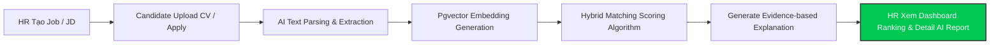

# 03. PHẠM VI DỰ ÁN VÀ MVP BASELINE (PROJECT SCOPE)

## 1. PHẠM VI THỰC HIỆN TRONG MVP (IN-SCOPE)

Tất cả các tính năng trong danh mục dưới đây là **bắt buộc triển khai hoàn chỉnh** trong phiên bản MVP:

### 1.1 Quản lý Tài khoản & Phân quyền (Authentication & Authorization)
* Đăng ký, Đăng nhập cho ứng viên (Candidate) và nhà tuyển dụng (HR/Recruiter).
* Phân quyền dựa trên vai trò (Role-Based Access Control - RBAC): Candidate, HR, Admin.
* Xác thực API bằng JWT (JSON Web Token) an toàn.

### 1.2 Quản lý Hồ sơ Ứng viên & CV (Candidate Profile & CV Management)
* Candidate cập nhật thông tin cá nhân (Họ tên, Email, Số điện thoại, Tiêu đề nghề nghiệp, Địa điểm).
* Candidate tải lên file CV dạng PDF hoặc DOCX (giới hạn dung lượng $\le 10\text{ MB}$).
* Hệ thống trích xuất văn bản từ CV, parse dữ liệu cấu trúc (Skills, Experience, Education) và lưu trữ an toàn.
* Candidate xem danh sách công việc đã nộp đơn và trạng thái ứng tuyển.

### 1.3 Quản lý Công ty & Tin Tuyển dụng (Employer & Job Management)
* HR cập nhật thông tin nhà tuyển dụng / công ty.
* HR tạo tin tuyển dụng mới với hai hình thức:
  * Nhập form chi tiết (Job Title, Required Skills, Preferred Skills, Experience Years, Education, Salary, Location, Seniority).
  * Nhập văn bản JD thô (Unstructured JD Text) $\rightarrow$ Hệ thống sử dụng AI tự động trích xuất thành JD cấu trúc.
* HR xuất bản (Publish), chỉnh sửa (Edit), đóng (Close) công việc.

### 1.4 Quy trình Ứng tuyển (Application Workflow)
* Candidate tìm kiếm công việc theo từ khóa, địa điểm, hình thức làm việc.
* Candidate xem chi tiết JD và thực hiện nộp đơn (Apply) bằng CV đã tải lên hoặc nộp CV mới.
* Hệ thống lưu trữ hồ sơ nộp đơn (`Application`) và kích hoạt quy trình AI Matching.

### 1.5 Hệ thống AI Extraction & Vector Embedding Engine
* **CV & JD Parsing:** Sử dụng LLM trích xuất chính xác các thực thể (Entities): Skills, Years of Experience, Seniority, Education Level, Certifications, Project details.
* **Chuẩn hóa (Normalization):** Đưa các kỹ năng về từ điển chuẩn (Ví dụ: `react.js`, `reactjs`, `react` $\rightarrow$ `React`).
* **Vector Embedding:** Sử dụng Embedding Model để tạo vector không gian cho JD và CV, lưu trữ trực tiếp vào cột `vector` trong **PostgreSQL via Pgvector**.

### 1.6 Hệ thống Tính điểm & Xếp hạng (Hybrid Scoring & Ranking Engine)
* **Scoring Model:** Tính toán tổng điểm `Match Score` (0–100%) dựa trên 5 thành phần có trọng số định sẵn:
  1. Required Skills Score
  2. Preferred Skills Score
  3. Experience Score
  4. Education & Certification Score
  5. Semantic Project Relevance Score
* **Ranking:** Tự động xếp hạng danh sách ứng viên đã nộp đơn cho từng công việc từ cao xuống thấp.
* **Filtering & Threshold:** HR có thể lọc ứng viên theo Match Score (VD: $\ge 70\%$), theo kỹ năng bắt buộc, hoặc theo số năm kinh nghiệm.

### 1.7 Minh chứng Giải thích kết quả AI (Evidence-based AI Explanation)
* Cung cấp bảng phân tích chi tiết cho từng ứng viên:
  * **Matching Skills:** Danh sách kỹ năng trùng khớp.
  * **Missing Skills:** Danh sách kỹ năng JD yêu cầu nhưng CV thiếu.
  * **Experience Comparison:** Số năm kinh nghiệm yêu cầu vs Số năm ứng viên có.
  * **Evidence Snippets:** Trích dẫn nguyên văn các đoạn văn bản trong CV làm bằng chứng cho đánh giá.
  * **AI Summary:** Đoạn tóm tắt nhận xét sự phù hợp ngắn gọn do LLM sinh ra.

---

## 2. PHẠM VI KHÔNG THỰC HIỆN TRONG MVP (OUT-OF-SCOPE)

Các chức năng sau đây **HOÀN TOÀN KHÔNG THỰC HIỆN** trong phạm vi MVP nhằm bảo đảm tập trung tối đa vào bài toán lõi JD–CV Matching:

1. **Phỏng vấn Online & Video Assessment:** Không triển khai phòng phỏng vấn trực tuyến, không quay/chấm điểm video ứng viên.
2. **Chấm điểm & Đánh giá Phỏng vấn (Interview Evaluation):** Không tạo bảng chấm điểm phỏng vấn cho người phỏng vấn.
3. **Quản lý Thư mời nhận việc (Offer Letter) & Ký hợp đồng (E-Sign):** Không phát hành thư mời làm việc hay tích hợp chữ ký số.
4. **Hội nhập nhân sự (Onboarding) & Quản lý Lương (Payroll):** Không quản lý hồ sơ nhân viên mới, bảng lương hay bảo hiểm.
5. **Hệ thống Quản trị Tuyển dụng hoàn chỉnh (Full ATS Workflow):** Không xây dựng quy trình tuyển dụng đa bước phức tạp (Sourcing, Screening, Interview 1, Interview 2, Background Check). Điểm kết thúc của MVP dừng lại ở việc **HR xem danh sách Xếp hạng & Minh chứng AI Matching**.
6. **Thu thập dữ liệu tự động từ GitHub/LinkedIn (GitHub/LinkedIn Web Scraper):** Không phụ thuộc vào việc cào dữ liệu từ GitHub hay LinkedIn để tránh rủi ro pháp lý và độ phức tạp tích hợp. Dữ liệu duy nhất dùng để đối sánh là CV do Ứng viên chủ động cung cấp và JD do HR đăng tải.
7. **Thanh toán trực tuyến & Gói dịch vụ (Payment & Subscriptions):** Không tích hợp cổng thanh toán (VNPAY, Stripe, Momo).
8. **Chat trực tiếp giữa HR và Candidate (Real-time Messaging):** Không xây dựng hệ thống chat trực tiếp trong ứng dụng.

---

## 3. R ANH GIỚI VÀ ĐIỂM KẾT THÚC CỦA MVP (MVP BOUNDARY STATEMENT)

**Điểm kết thúc (Terminal State) của quy trình MVP:**
Khi HR truy cập vào trang **Candidate Ranking & AI Explanation** của một vị trí tuyển dụng, xem được danh sách ứng viên được xếp hạng theo Match Score %, lọc được các kỹ năng trùng/thiếu, đọc được minh chứng trích dẫn từ CV và xem đoạn nhận xét của AI. Toàn bộ các thao tác sau đó (liên hệ ứng viên qua Email/Điện thoại bên ngoài) nằm ngoài phạm vi phần mềm.
