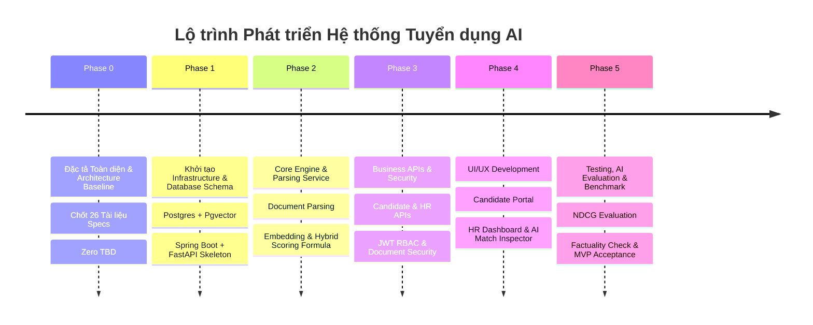

# 04. YÊU CẦU SẢN PHẨM MỤC TIÊU (PRODUCT REQUIREMENTS & GOALS)

## 1. MỤC TIÊU SẢN PHẨM (PRODUCT GOALS)
1. **Chất lượng Đối sánh (Matching Precision):** Cung cấp mô hình chấm điểm JD–CV tiệm cận với đánh giá của chuyên gia tuyển dụng (Senior Recruiter), đạt độ chính xác trích xuất thực thể $\ge 90\%$.
2. **Giải thích Minh bạch (Explainable AI - XAI):** 100% điểm Match Score được minh chứng bằng các trích đoạn văn bản thực tế trích xuất từ CV, không hallucination.
3. **Tối ưu trải nghiệm người dùng (UX Excellence):** Giao diện hiện đại (Card-based layout, Dark/Light theme hỗ trợ, visual score indicator, responsive design), trực quan, dễ thao tác cho cả HR và Candidate.

## 2. MỤC TIÊU KINH DOANH (BUSINESS GOALS)
1. **Giảm thời gian sàng lọc (Time-to-Screen reduction):** Giảm thời gian HR xem xét và phân loại 100 CV từ 8 giờ xuống dưới 15 phút.
2. **Giảm tỷ lệ bỏ sót ứng viên giỏi (False Negative Reduction):** Giảm $80\%$ tỷ lệ loại sai ứng viên tiềm năng do lỗi tìm kiếm từ khóa cứng (Exact Keyword Match).
3. **Tăng tỷ lệ ứng tuyển thành công (Application Conversion):** Giúp ứng viên tự đánh giá độ phù hợp với JD trước khi nộp đơn, cải thiện chất lượng hồ sơ ứng tuyển.

## 3. MỤC TIÊU NGUYÊN TẮC NGƯỜI DÙNG (USER GOALS)

### 3.1 Mục tiêu của Candidate (Ứng viên)
* Dễ dàng tạo profile và nộp CV định dạng PDF/DOCX chỉ trong vài cú click.
* Tìm kiếm công việc chính xác theo kỹ năng và địa điểm.
* Theo dõi minh bạch trạng thái nộp đơn và danh sách công việc đã ứng tuyển.

### 3.2 Mục tiêu của HR / Recruiter (Nhà tuyển dụng)
* Nhanh chóng tạo JD chuẩn hóa bằng công cụ hỗ trợ AI.
* Tự động nhận danh sách ứng viên đã được sàng lọc và xếp hạng theo thứ tự độ phù hợp giảm dần.
* Đọc nhanh lý do vì sao một ứng viên đạt $85\%$ hay $50\%$ thông qua bảng so sánh Kỹ năng trùng / Kỹ năng thiếu / Minh chứng kinh nghiệm.

## 4. CHỈ SỐ ĐO LƯỜNG HIỆU QUẢ CỐT LÕI (KEY PERFORMANCE INDICATORS - KPIS)

| Chỉ số (KPI) | Mục tiêu (Target Value) | Phương pháp đo lường |
| :--- | :--- | :--- |
| **Accuracy of Entity Extraction** | $\ge 90\%$ | So sánh thực thể do AI trích xuất từ CV/JD với nhãn chuẩn thủ công (Ground Truth Test Dataset). |
| **Ranking Relevance (NDCG@10)** | $\ge 0.85$ | Normalized Discounted Cumulative Gain trên Top 10 ứng viên được AI xếp hạng so với thứ tự HR đánh giá. |
| **Explanation Factuality Rate** | $100\%$ | Trích dẫn minh chứng trong đoạn giải thích phải tồn tại nguyên văn trong CV (0% ảo giác). |
| **CV Processing Latency** | $< 5.0\text{s}$ | Thời gian trung bình từ lúc Candidate submit CV đến khi trích xuất, tạo vector và tính điểm hoàn tất. |
| **Vector Search Latency** | $< 200\text{ms}$ | Thời gian truy vấn tìm kiếm Vector tương đồng trên 100,000 records bằng Pgvector. |
| **System Uptime** | $99.9\%$ | Tỷ lệ sẵn sàng của hệ thống trong thời gian hoạt động. |

## 5. CÁC CỘT MỐC SẢN PHẨM & LỘ TRÌNH (PRODUCT ROADMAP OVERVIEW)

