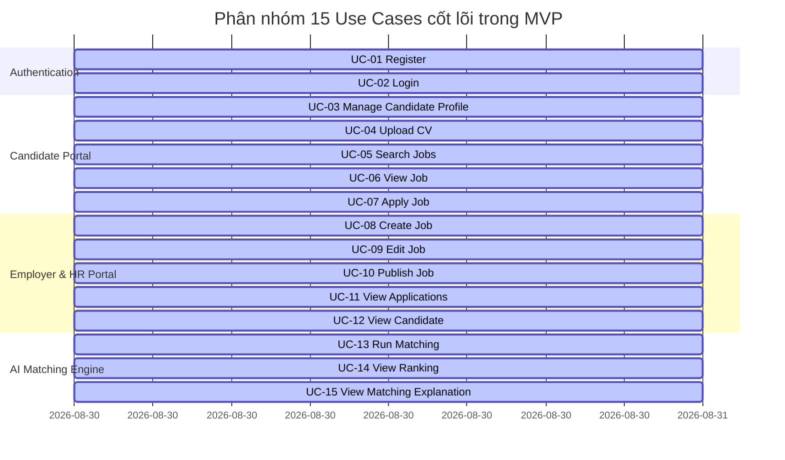

# 09. ĐẶC TẢ USE CASE VÀ DIAGRAM (USE CASES SPECIFICATION)

Tài liệu này tổng hợp Use Case Diagram và đặc tả chi tiết 15 Use Cases cốt lõi của Hệ thống Tuyển dụng AI.

---

## 1. PHÂN NHÓM USE CASE VÀ DIAGRAM

---

## 2. CHI TIẾT ĐẶC TẢ CÁC USE CASE (UC SPECIFICATIONS)

### UC-01: Register (Đăng ký tài khoản)
* **Actor:** Candidate, HR.
* **Precondition:** Người dùng chưa đăng nhập.
* **Main Flow:**
  1. Người dùng chọn Đăng ký, nhập Email, Mật khẩu, Chọn vai trò (Candidate/HR).
  2. Hệ thống kiểm tra dữ liệu đầu vào.
  3. Hệ thống tạo tài khoản mới và lưu vào CSDL.
* **Postcondition:** Khởi tạo thông tin User và Profile tương ứng.

### UC-02: Login (Đăng nhập)
* **Actor:** Candidate, HR.
* **Precondition:** Người dùng đã có tài khoản.
* **Main Flow:**
  1. Người dùng nhập Email và Mật khẩu.
  2. Hệ thống xác thực và cấp mã JWT AccessToken cùng RefreshToken.
* **Postcondition:** Người dùng được chuyển hướng đến Dashboard theo vai trò.

### UC-03: Manage Candidate Profile (Quản lý Profile Ứng viên)
* **Actor:** Candidate.
* **Precondition:** Candidate đã đăng nhập.
* **Main Flow:** Candidate cập nhật họ tên, tiêu đề nghề nghiệp, số điện thoại, địa điểm, bio cá nhân.

### UC-04: Upload CV (Tải lên CV PDF/DOCX)
* **Actor:** Candidate.
* **Precondition:** Candidate đã đăng nhập.
* **Main Flow:** Candidate chọn file PDF/DOCX $\rightarrow$ Upload $\rightarrow$ Kích hoạt AI Text Extraction & Parsing.

### UC-05: Search Jobs (Tìm kiếm Việc làm)
* **Actor:** Candidate, Guest.
* **Main Flow:** Nhập từ khóa, chọn địa điểm, loại hình công việc $\rightarrow$ Hiển thị danh sách Job Cards phù hợp.

### UC-06: View Job (Xem Chi tiết Bài tuyển dụng)
* **Actor:** Candidate, Guest.
* **Main Flow:** Chọn 1 Job Card $\rightarrow$ Hiển thị chi tiết Yêu cầu (Required/Preferred), Mức lương, Mô tả công việc, Nút Apply.

### UC-07: Apply Job (Ứng tuyển Công việc)
* **Actor:** Candidate.
* **Precondition:** Candidate đã đăng nhập và có CV.
* **Main Flow:** Nhấn "Apply" $\rightarrow$ Chọn CV $\rightarrow$ Xác nhận $\rightarrow$ Tạo bản ghi Application $\rightarrow$ Kích hoạt AI Matching.

### UC-08: Create Job (Tạo Tin tuyển dụng)
* **Actor:** HR.
* **Precondition:** HR đã đăng nhập.
* **Main Flow:** Nhập thông tin JD thủ công hoặc dán văn bản thô để AI trích xuất $\rightarrow$ Lưu bản ghi Job ở dạng Draft hoặc Published.

### UC-09: Edit Job (Chỉnh sửa Tin tuyển dụng)
* **Actor:** HR.
* **Main Flow:** Chỉnh sửa tiêu đề, mô tả, yêu cầu kỹ năng của Job hiện có $\rightarrow$ Lưu thay đổi.

### UC-10: Publish Job (Đăng bài Tuyển dụng)
* **Actor:** HR.
* **Main Flow:** Chuyển trạng thái Job từ `DRAFT` sang `PUBLISHED` $\rightarrow$ Đã tạo Vector Embedding cho JD $\rightarrow$ Job xuất hiện ở kết quả tìm kiếm.

### UC-11: View Applications (Xem Danh sách Đơn ứng tuyển)
* **Actor:** HR.
* **Main Flow:** HR chọn bài tuyển dụng $\rightarrow$ Hiển thị danh sách tất cả các ứng viên đã nộp đơn cho bài tuyển dụng đó.

### UC-12: View Candidate (Xem Chi tiết Ứng viên)
* **Actor:** HR.
* **Main Flow:** HR nhấn chọn 1 ứng viên $\rightarrow$ Xem thông tin profile và trực tiếp xem/tải file CV của ứng viên.

### UC-13: Run Matching (Kích hoạt AI Matching Engine)
* **Actor:** System AI / HR.
* **Main Flow:** Tự động chạy khi có đơn ứng tuyển mới hoặc khi HR bấm "Chạy lại Matching" $\rightarrow$ Phân tích dữ liệu, tính điểm 5 thành phần $\rightarrow$ Lưu bản ghi `MatchResult`.

### UC-14: View Ranking (Xem Bảng Xếp hạng Ứng viên)
* **Actor:** HR.
* **Main Flow:** HR xem danh sách ứng viên đã được sắp xếp tự động theo `Match Score` giảm dần $\rightarrow$ Lọc theo Threshold/Skills.

### UC-15: View Matching Explanation (Xem Giải thích Minh chứng AI)
* **Actor:** HR.
* **Main Flow:** HR nhấn chọn xem báo cáo chi tiết $\rightarrow$ Hiển thị Match Score, Kỹ năng khớp, Kỹ năng thiếu, So sánh số năm kinh nghiệm và các đoạn trích văn bản nguyên bản từ CV làm bằng chứng.
