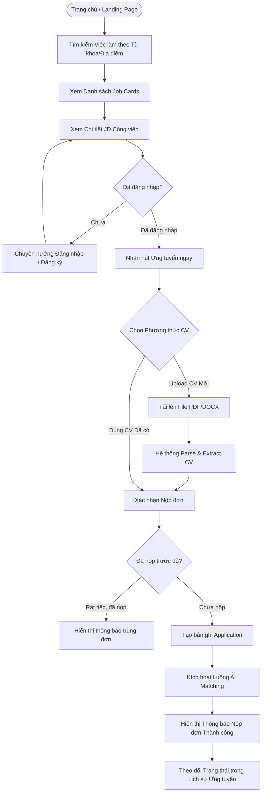
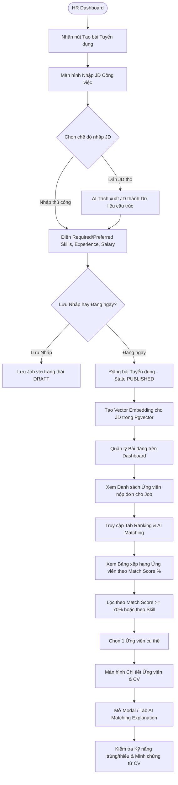
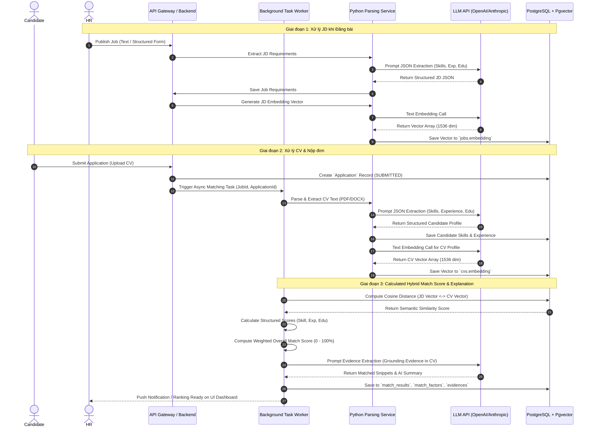

# 10. ĐẶC TẢ LỒNG QUY TRÌNH NGƯỜI DÙNG VÀ HỆ THỐNG (USER FLOWS)

Tài liệu này đặc tả quy trình thao tác từng bước bằng sơ đồ Mermaid cho Candidate Flow, HR Flow và AI Matching System Flow.

---

## 1. LUỒNG ỨNG VIÊN (CANDIDATE USER FLOW)

---

## 2. LUỒNG NHÀ TUYỂN DỤNG (HR / RECRUITER USER FLOW)

---

## 3. LUỒNG XỬ LÝ NỘI BỘ AI MATCHING ENGINE (SYSTEM AI FLOW)

