# 11. KIẾN TRÚC THÔNG TIN VÀ Sơ ĐỒ TRANG (INFORMATION ARCHITECTURE)

Tài liệu này đặc tả sơ đồ trang (Sitemap), cây phân cấp thông tin và định tuyến điều hướng người dùng cho cả Candidate và HR portals.

---

## 1. SƠ ĐỒ TRANG TỔNG QUAN (SITEMAP MATRIX)

```mermaid
graph TD
    Root[Trang Chủ Platform] --> AuthGroup[Nhóm Xác thực]
    AuthGroup --> P04[04 Login Screen]
    AuthGroup --> P05[05 Register Screen]
    
    Root --> CandPortal[Candidate Portal]
    CandPortal --> P01[01 Public Landing Page]
    CandPortal --> P02[02 Job Search Results]
    CandPortal --> P03[03 Job Detail Page]
    CandPortal --> P06[06 Candidate Profile Page]
    CandPortal --> P07[07 CV Upload & Management]
    CandPortal --> P08[08 Application History]
    
    Root --> HRPortal[HR / Employer Portal]
    HRPortal --> P09[09 HR Employer Dashboard]
    HRPortal --> P10[10 Job Management Screen]
    HRPortal --> P11[11 Create/Edit Job Screen]
    HRPortal --> P12[12 Candidate Applications Screen]
    HRPortal --> P13[13 Candidate Ranking Screen]
    HRPortal --> P14[14 Candidate Detail Screen]
    HRPortal --> P15[15 AI Explanation Modal/View]
```

---

## 2. PHÂN CẤP ĐIỀU HƯỚNG THEO ROLE (NAVIGATION TAXONOMY)

### 2.1 Candidate Navigation
* **Header Nav:** Tìm việc làm | Lịch sử ứng tuyển | CV của tôi | Profile cá nhân | Đăng xuất.
* **Footer Nav:** Về chúng tôi | Điều khoản sử dụng | Bảo mật thông tin | Hỗ trợ ứng viên.

### 2.2 HR Navigation
* **Sidebar / Header Nav:** Dashboard tổng quan | Quản lý Công việc | Tạo bài tuyển dụng | Công ty của tôi | Cấu hình tài khoản | Đăng xuất.
* **Job Detail Sub-nav:** Thông tin JD | Danh sách Đơn ứng tuyển | Bảng xếp hạng AI Matching.
