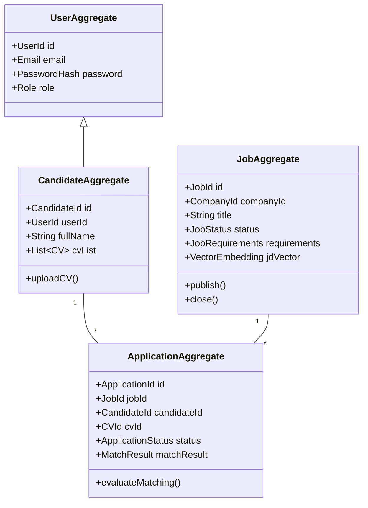

# 13. MÔ HÌNH MIỀN DỮ LIỆU (DOMAIN MODEL SPECIFICATION)

Tài liệu này đặc tả Mô hình Miền (Domain Model) theo phương pháp Domain-Driven Design (DDD), bao gồm các Aggregates, Entities, Value Objects, và Domain Events.

---

## 1. TỔNG QUAN DOMAIN AGGREGATES

---

## 2. CHI TIẾT CÁC THÀNH PHẦN DOMAIN

### 2.1 Aggregate: Job (Công việc Tuyển dụng)
* **Root Entity:** `Job`
* **Entities liên thuộc:** `JobRequirement`
* **Value Objects:** `JobId`, `JobStatus` (`DRAFT`, `PUBLISHED`, `CLOSED`), `SeniorityLevel`, `VectorEmbedding`.
* **Business Logic Method:**
  * `publish()`: Đổi trạng thái sang `PUBLISHED`, yêu cầu phải có `jdVector` hợp lệ.
  * `updateRequirements(Requirements reqs)`: Cập nhật yêu cầu và đánh dấu cần re-index vector.

### 2.2 Aggregate: Candidate (Ứng viên)
* **Root Entity:** `CandidateProfile`
* **Entities liên thuộc:** `CV`, `CandidateSkill`, `ExperienceItem`, `EducationItem`.
* **Value Objects:** `CandidateId`, `CVId`, `SkillName`, `DurationYears`.

### 2.3 Aggregate: Application & AI Matching (Đơn ứng tuyển & Đối sánh)
* **Root Entity:** `Application`
* **Entities liên thuộc:** `MatchResult`, `MatchFactor`, `EvidenceSnippet`.
* **Value Objects:** `ApplicationId`, `MatchScore` (Value Object bọc giá trị $0.0 - 100.0$), `MatchingCategory` (`HIGH`, `MEDIUM`, `LOW`).

---

## 3. CÁC SỰ KIỆN MIỀN CHÍNH (DOMAIN EVENTS)
1. `JobPublishedEvent`: Phát ra khi HR xuất bản Job $\rightarrow$ Trigger sinh JD Vector Embedding.
2. `CVUploadedEvent`: Phát ra khi Candidate upload CV $\rightarrow$ Trigger Task Worker Parse PDF/DOCX.
3. `ApplicationSubmittedEvent`: Phát ra khi nộp đơn thành công $\rightarrow$ Trigger AI Hybrid Matching Engine.
4. `MatchResultCalculatedEvent`: Phát ra khi chấm điểm xong $\rightarrow$ Cập nhật Bảng xếp hạng Ranking cho HR.
