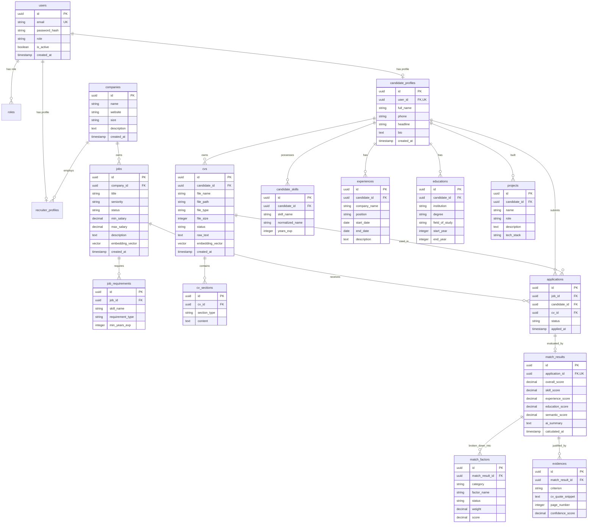

# 14. ĐẶC TẢ SƠ ĐỒ THỰC THỂ LIÊN KẾT (ERD SPECIFICATION)

Tài liệu này đặc tả chi tiết Sơ đồ Thực thể Liên kết (ERD) với đầy đủ Khóa chính (PK), Khóa ngoại (FK), Quan hệ (Cardinality), Ràng buộc (Constraints), Nullability, Unique Keys và Indexing strategy.

---

## 1. SƠ ĐỒ ERD TỔNG QUAN (MERMAID ERD DIAGRAM)

---

## 2. RÀNG BUỘC VÀ QUY TẮC DỮ LIỆU (CONSTRAINTS & KEYS)

### 2.1 Unique Constraints
* `users(email)`: Đảm bảo không trùng lặp tài khoản.
* `candidate_profiles(user_id)`: Quan hệ 1-1 giữa User và Candidate Profile.
* `applications(job_id, candidate_id)`: Một ứng viên chỉ được nộp đơn 1 lần duy nhất cho mỗi bài tuyển dụng (`UNIQUE INDEX idx_uniq_app`).
* `match_results(application_id)`: Quan hệ 1-1 giữa Application và MatchResult.

### 2.2 Foreign Key Rules (ON DELETE Policy)
* `applications` $\rightarrow$ `jobs`: `ON DELETE CASCADE`.
* `cvs` $\rightarrow$ `candidate_profiles`: `ON DELETE CASCADE`.
* `match_results` $\rightarrow$ `applications`: `ON DELETE CASCADE`.
* `match_factors`, `evidences` $\rightarrow$ `match_results`: `ON DELETE CASCADE`.
