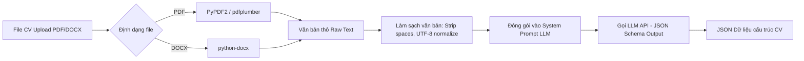

# 17. ĐẶC TẢ TỰ ĐỘNG PARSING VÀ TÁCH THỰC THỂ AI (AI PARSING & EXTRACTION SPEC)

Tài liệu này đặc tả quy trình đọc file CV (PDF/DOCX), trích xuất văn bản thô, dùng LLM tách thực thể cấu trúc và chuẩn hóa dữ liệu.

---

## 1. QUY TRÌNH TRÍCH XUẤT VĂN BẢN (TEXT EXTRACTION PIPELINE)



---

## 2. SYSTEM PROMPT MẪU CHO TRÍCH XUẤT CV (CV EXTRACTION PROMPT)

```json
{
  "system_prompt": "You are an expert AI Resume Parser. Extract structured information from the candidate resume text into strict JSON adhering to the specified schema. Do not hallucinate or add skills not present in the text.",
  "json_schema_format": {
    "fullName": "string",
    "email": "string",
    "phone": "string",
    "headline": "string",
    "totalExperienceYears": "number",
    "skills": [
      {
        "name": "string",
        "yearsOfExp": "number"
      }
    ],
    "workHistory": [
      {
        "company": "string",
        "position": "string",
        "startDate": "YYYY-MM",
        "endDate": "YYYY-MM or Present",
        "techStack": ["string"],
        "description": "string"
      }
    ],
    "education": [
      {
        "institution": "string",
        "degree": "string",
        "fieldOfStudy": "string",
        "graduationYear": "number"
      }
    ]
  }
}
```

---

## 3. QUY TRÌNH CHUẨN HÓA KỸ NĂNG (SKILL NORMALIZATION)

1. Chuyển toàn bộ tên kỹ năng trích xuất về dạng chữ thường.
2. Tra cứu qua Từ điển Ánh xạ (Lookup Dictionary Mapping Table).
3. Nếu không có trong dictionary, sử dụng Levenshtein Distance ($> 0.85$) hoặc Embedding similarity để gán vào nhãn kỹ năng chuẩn tương ứng.
