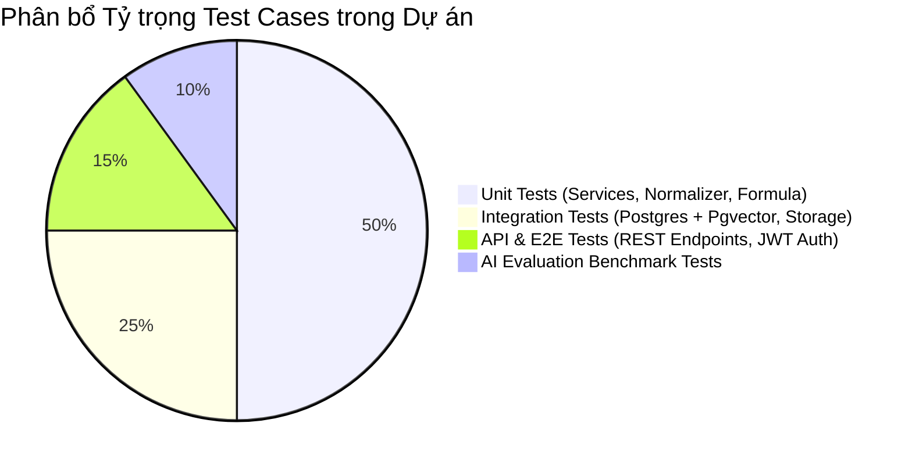

# 22. CHIẾN LƯỢC VÀ KẾ HOẠCH KIỂM THỬ (TEST STRATEGY & TEST SUITE SPEC)

Tài liệu này đặc tả Chiến lược Kiểm thử cho toàn bộ ứng dụng bao gồm Unit Testing, Integration Testing, End-to-End API Testing và UI Testing.

---

## 1. PHÂN CẤP CÁC TẦNG KIỂM THỬ (TEST PYRAMID)

---

## 2. NỘI DUNG CÁC TẦNG KIỂM THỬ

### 2.1 Unit Tests (Kiểm thử Đơn vị)
* **Phạm vi:** Kiểm thử các class Java Service (`JobService`, `MatchingScoringCalculator`, `SkillNormalizer`) và Python Extractor functions.
* **Mục tiêu:** Coverage code $\ge 80\%$.
* **Test Case Mẫu:**
  * `testCalculateOverallScore_ValidSubScores()`: Kiểm tra công thức trọng số cho ra đúng $91.70\%$.
  * `testSkillNormalizer_SynonymsMapping()`: Kiểm tra ánh xạ "React.js" $\rightarrow$ "React".

### 2.2 Integration Tests (Kiểm thử Tích hợp CSDL & Pgvector)
* **Phạm vi:** Sử dụng Testcontainers (PostgreSQL + Pgvector) để kiểm thử tầng Persistence Repositories.
* **Test Case Mẫu:**
  * `testHnswIndex_CosineSearch()`: Kiểm tra câu lệnh SQL truy vấn tìm kiếm Vector tương đồng trên CSDL thực nghiệm trả về đúng top 5 CV gần nhất trong $< 200\text{ms}$.

### 2.3 End-to-End API Tests (Kiểm thử Đầu-Cuối API)
* **Công cụ:** Postman / REST Assured.
* **Luồng E2E:** 
  1. Đăng ký HR $\rightarrow$ Đăng nhập $\rightarrow$ Tạo Job $\rightarrow$ Publish Job.
  2. Đăng ký Candidate $\rightarrow$ Upload CV $\rightarrow$ Apply Job.
  3. HR gọi API GET Ranking $\rightarrow$ Kiểm tra StatusCode `200` và trả về đúng danh sách ứng viên có Match Score.

### 2.4 UI Component Tests
* **Công cụ:** Jest / React Testing Library.
* **Phạm vi:** Kiểm thử render các component UI cốt lõi (JobCard, MatchScoreCircle, EvidenceModal, State Indicators).
